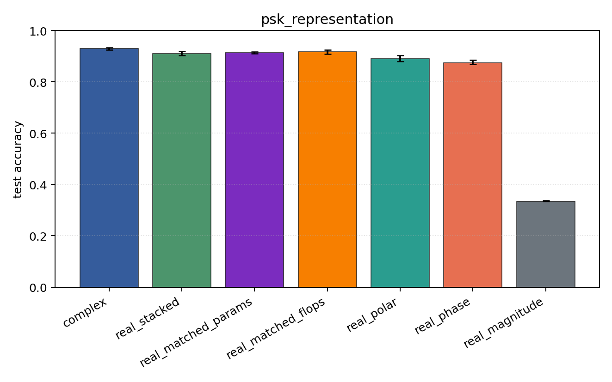
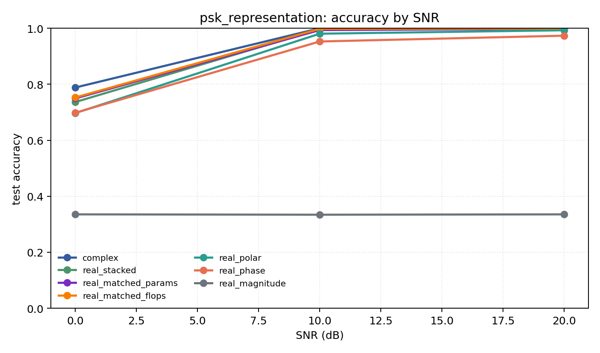

# psk_representation

Question: Do phase-aware encodings explain PSK-family performance?

Contradiction signal: magnitude-only approaches phase/Cartesian accuracy, or real encodings consistently beat complex.

Modulations: `['bpsk', 'qpsk', '8psk']`. SNR (dB): `[0, 10, 20]`. Architecture: `conv`. Activation: `cardioid`. Train transform: `none`. Test transform: `none`.

## Plots

| model | hidden | params | MAdds | accuracy | std | 95% CI | loss | s/run |
| --- | ---: | ---: | ---: | ---: | ---: | --- | ---: | ---: |
| `complex` | 32 | 10886 | 2703744 | 0.9294 | 0.0054 | [0.9251, 0.9331] | 0.165 | 5.4 |
| `real_stacked` | 32 | 5603 | 696416 | 0.9105 | 0.0107 | [0.9027, 0.9197] | 0.198 | 2.4 |
| `real_matched_params` | 45 | 10803 | 1353735 | 0.9137 | 0.0050 | [0.9107, 0.9182] | 0.204 | 1.9 |
| `real_matched_flops` | 64 | 21443 | 2703552 | 0.9167 | 0.0099 | [0.9085, 0.9243] | 0.18 | 2.4 |
| `real_polar` | 32 | 5763 | 716896 | 0.8902 | 0.0154 | [0.8803, 0.9040] | 0.237 | 2 |
| `real_phase` | 32 | 5603 | 696416 | 0.8749 | 0.0111 | [0.8682, 0.8848] | 0.274 | 1.9 |
| `real_magnitude` | 32 | 5443 | 675936 | 0.3348 | 0.0034 | [0.3333, 0.3379] | 1.1 | 1.2 |

## Accuracy by SNR (dB)

| model | 0 dB | 10 dB | 20 dB |
| --- | ---: | ---: | ---: |
| `complex` | 0.788 | 1.000 | 1.000 |
| `real_stacked` | 0.737 | 0.996 | 0.999 |
| `real_matched_params` | 0.750 | 0.994 | 0.998 |
| `real_matched_flops` | 0.753 | 0.998 | 0.999 |
| `real_polar` | 0.697 | 0.981 | 0.993 |
| `real_phase` | 0.698 | 0.953 | 0.973 |
| `real_magnitude` | 0.335 | 0.334 | 0.335 |
