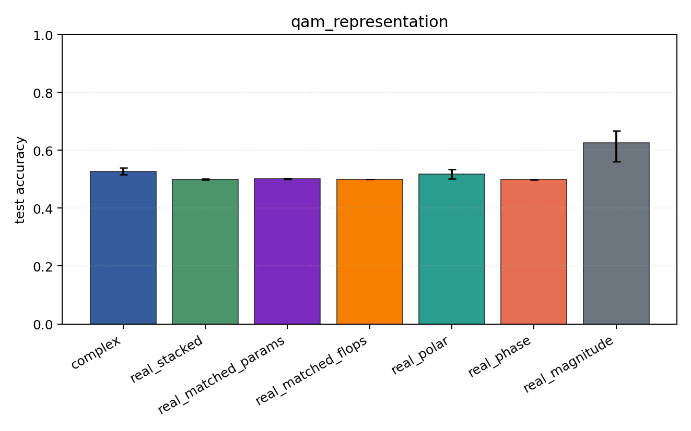
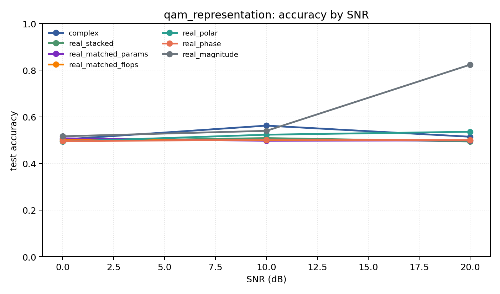

# qam_representation

Question: Does amplitude structure change the story on QAM-only data?

Contradiction signal: magnitude-only becomes competitive, or phase-only collapses relative to Cartesian/polar.

Modulations: `['qam16', 'qam64']`. SNR (dB): `[0, 10, 20]`. Architecture: `conv`. Activation: `cardioid`. Train transform: `none`. Test transform: `none`.

## Plots

| model | hidden | params | MAdds | accuracy | std | 95% CI | loss | s/run |
| --- | ---: | ---: | ---: | ---: | ---: | --- | ---: | ---: |
| `complex` | 32 | 10820 | 2703616 | 0.5265 | 0.0147 | [0.5165, 0.5388] | 0.878 | 6.5 |
| `real_stacked` | 32 | 5570 | 696384 | 0.4994 | 0.0025 | [0.4971, 0.5010] | 0.694 | 1.9 |
| `real_matched_params` | 45 | 10757 | 1353690 | 0.5013 | 0.0029 | [0.5000, 0.5039] | 0.697 | 2.1 |
| `real_matched_flops` | 64 | 21378 | 2703488 | 0.5000 | 0.0000 | [0.5000, 0.5000] | 0.693 | 2.9 |
| `real_polar` | 32 | 5730 | 716864 | 0.5178 | 0.0212 | [0.5016, 0.5343] | 0.702 | 1.6 |
| `real_phase` | 32 | 5570 | 696384 | 0.4990 | 0.0022 | [0.4971, 0.5000] | 0.695 | 1.8 |
| `real_magnitude` | 32 | 5410 | 675904 | 0.6265 | 0.0720 | [0.5608, 0.6680] | 0.615 | 2.4 |

## Accuracy by SNR (dB)

| model | 0 dB | 10 dB | 20 dB |
| --- | ---: | ---: | ---: |
| `complex` | 0.503 | 0.562 | 0.515 |
| `real_stacked` | 0.495 | 0.509 | 0.494 |
| `real_matched_params` | 0.508 | 0.497 | 0.499 |
| `real_matched_flops` | 0.500 | 0.500 | 0.500 |
| `real_polar` | 0.494 | 0.523 | 0.536 |
| `real_phase` | 0.495 | 0.502 | 0.500 |
| `real_magnitude` | 0.517 | 0.540 | 0.823 |
