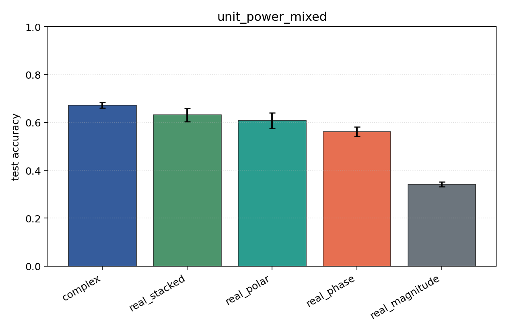
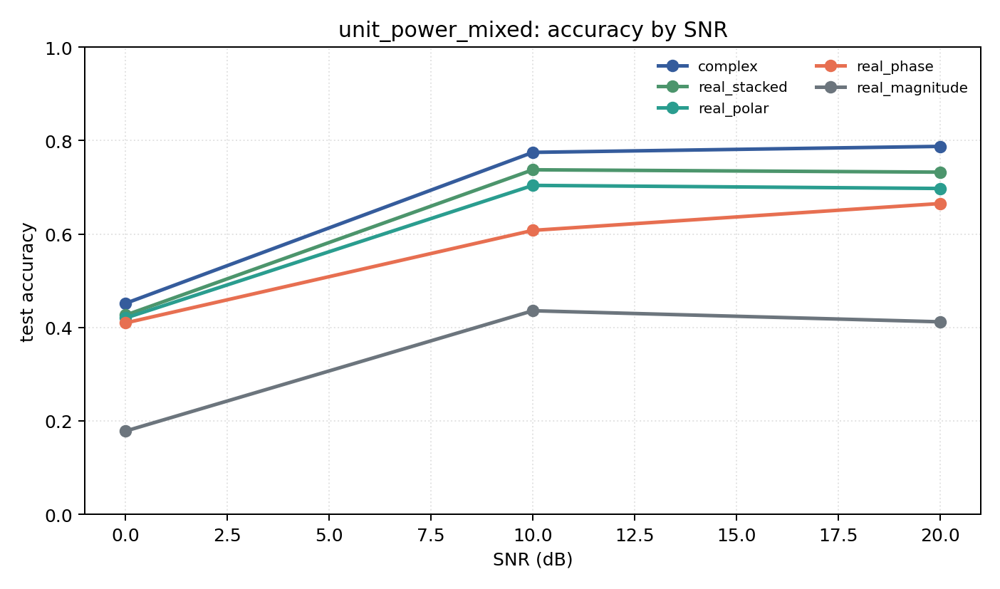

# unit_power_mixed

Question: Does per-example energy normalization change the ranking?

Contradiction signal: rankings change substantially, suggesting models were using energy/SNR scale rather than modulation geometry.

Modulations: `['bpsk', 'qpsk', '8psk', 'qam16', 'qam64']`. SNR (dB): `[0, 10, 20]`. Architecture: `conv`. Activation: `cardioid`. Train transform: `unit_power`. Test transform: `unit_power`.

## Plots

| model | hidden | params | MAdds | accuracy | std | 95% CI | loss | s/run |
| --- | ---: | ---: | ---: | ---: | ---: | --- | ---: | ---: |
| `complex` | 32 | 11018 | 2704000 | 0.6713 | 0.0143 | [0.6593, 0.6830] | 0.711 | 4.3 |
| `real_stacked` | 32 | 5669 | 696480 | 0.6321 | 0.0355 | [0.6027, 0.6583] | 0.823 | 2.3 |
| `real_polar` | 32 | 5829 | 716960 | 0.6072 | 0.0431 | [0.5750, 0.6392] | 0.855 | 2.4 |
| `real_phase` | 32 | 5669 | 696480 | 0.5609 | 0.0259 | [0.5407, 0.5811] | 0.945 | 2.3 |
| `real_magnitude` | 32 | 5509 | 676000 | 0.3420 | 0.0134 | [0.3310, 0.3515] | 1.29 | 2.2 |

## Accuracy by SNR (dB)

| model | 0 dB | 10 dB | 20 dB |
| --- | ---: | ---: | ---: |
| `complex` | 0.452 | 0.775 | 0.788 |
| `real_stacked` | 0.426 | 0.737 | 0.732 |
| `real_polar` | 0.420 | 0.704 | 0.697 |
| `real_phase` | 0.410 | 0.608 | 0.665 |
| `real_magnitude` | 0.178 | 0.436 | 0.412 |
