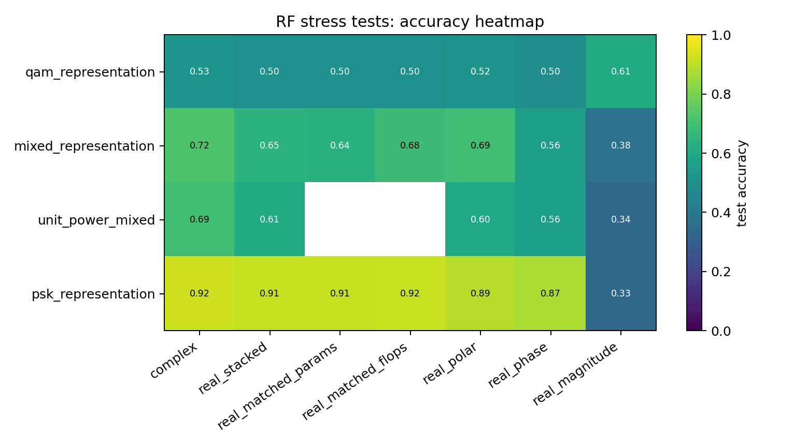
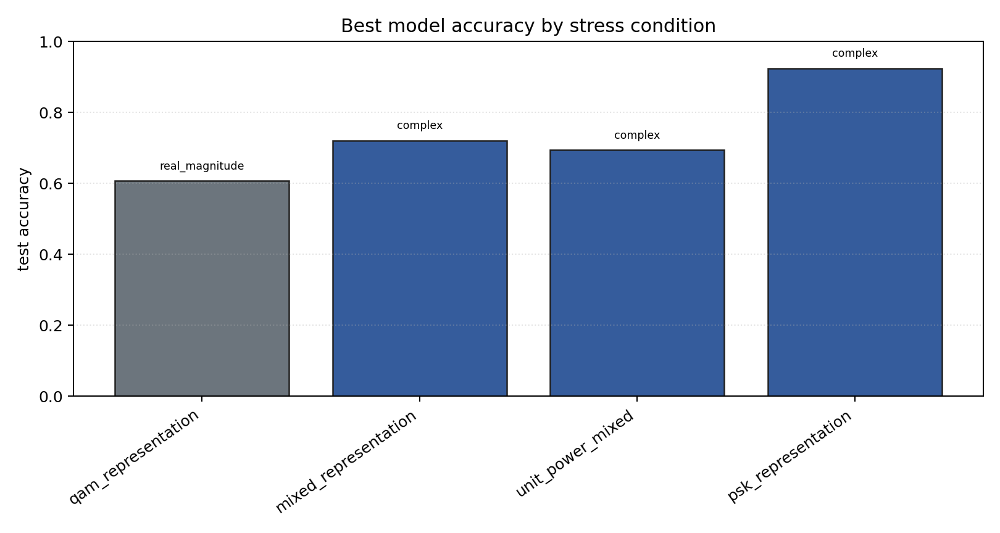

# RF Synthetic Representation Stress Tests

Sequential contradiction tests for whether complex-valued RF models help because of native complex arithmetic, coordinate choice, phase information, augmentation, or compute budget.

## Plots

| condition | best | acc | complex | real_stack | phase | polar | magnitude |
| --- | --- | ---: | ---: | ---: | ---: | ---: | ---: |
| `qam_representation` | `real_magnitude` | 0.6065 | 0.5269 | 0.5036 | 0.4977 | 0.5172 | 0.6065 |
| `mixed_representation` | `complex` | 0.7208 | 0.7208 | 0.6469 | 0.5601 | 0.6948 | 0.3755 |
| `unit_power_mixed` | `complex` | 0.6940 | 0.6940 | 0.6092 | 0.5617 | 0.6008 | 0.3450 |
| `psk_representation` | `complex` | 0.9245 | 0.9245 | 0.9118 | 0.8736 | 0.8943 | 0.3327 |

Each condition directory contains `raw_runs.json`, `summary.json`, `summary.md`, and `manifest.json`.
