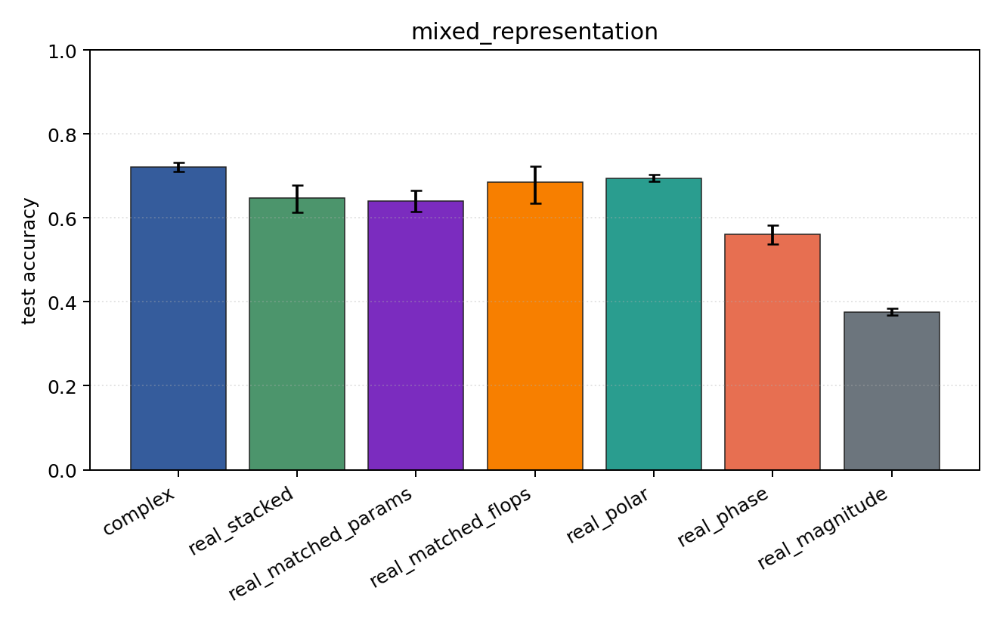
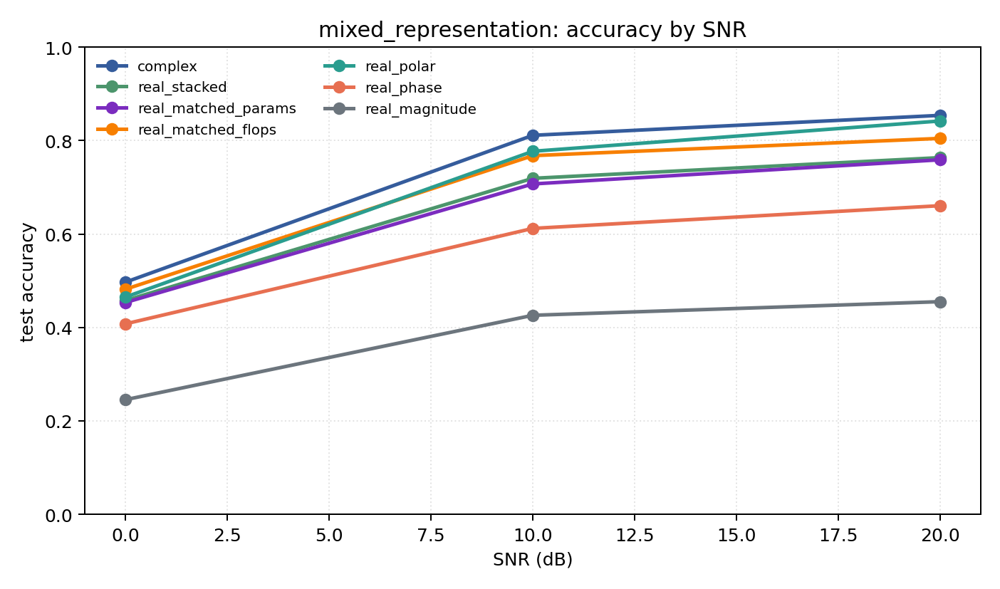

# mixed_representation

Question: Does the representation conclusion survive PSK+QAM together?

Contradiction signal: a hand-chosen real coordinate system matches or beats the complex model over mixed modulation families.

Modulations: `['bpsk', 'qpsk', '8psk', 'qam16', 'qam64']`. SNR (dB): `[0, 10, 20]`. Architecture: `conv`. Activation: `crelu`. Train transform: `none`. Test transform: `none`.

## Plots

| model | hidden | params | MAdds | accuracy | std | 95% CI | loss | s/run |
| --- | ---: | ---: | ---: | ---: | ---: | --- | ---: | ---: |
| `complex` | 32 | 11018 | 2704000 | 0.7208 | 0.0140 | [0.7107, 0.7327] | 0.583 | 4.8 |
| `real_stacked` | 32 | 5669 | 696480 | 0.6469 | 0.0424 | [0.6126, 0.6787] | 0.791 | 1.6 |
| `real_matched_params` | 45 | 10895 | 1353825 | 0.6399 | 0.0322 | [0.6141, 0.6656] | 0.813 | 1.8 |
| `real_matched_flops` | 64 | 21573 | 2703680 | 0.6848 | 0.0589 | [0.6353, 0.7238] | 0.682 | 2.6 |
| `real_polar` | 32 | 5829 | 716960 | 0.6948 | 0.0093 | [0.6878, 0.7024] | 0.645 | 2.1 |
| `real_phase` | 32 | 5669 | 696480 | 0.5601 | 0.0291 | [0.5368, 0.5817] | 0.943 | 1.4 |
| `real_magnitude` | 32 | 5509 | 676000 | 0.3755 | 0.0100 | [0.3678, 0.3837] | 1.18 | 1.6 |

## Accuracy by SNR (dB)

| model | 0 dB | 10 dB | 20 dB |
| --- | ---: | ---: | ---: |
| `complex` | 0.497 | 0.811 | 0.854 |
| `real_stacked` | 0.458 | 0.719 | 0.763 |
| `real_matched_params` | 0.454 | 0.707 | 0.759 |
| `real_matched_flops` | 0.482 | 0.768 | 0.805 |
| `real_polar` | 0.465 | 0.777 | 0.842 |
| `real_phase` | 0.408 | 0.612 | 0.661 |
| `real_magnitude` | 0.245 | 0.426 | 0.455 |
