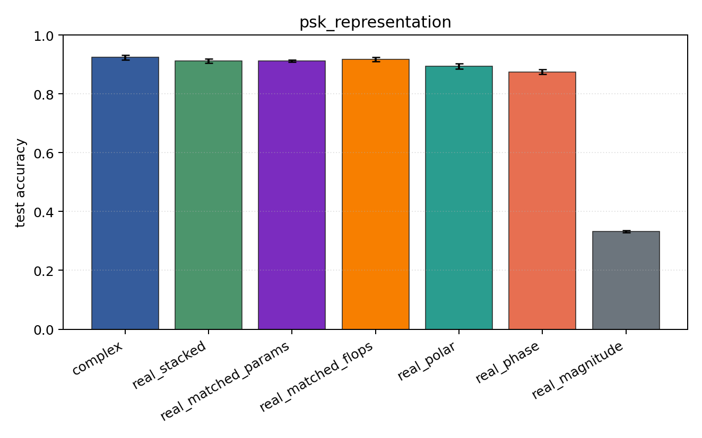
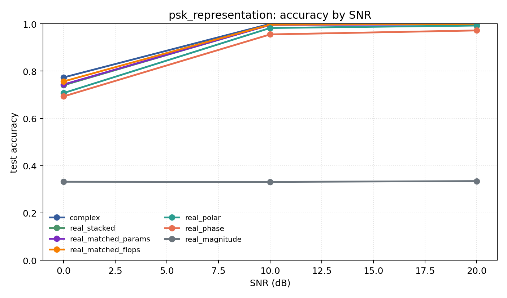

# psk_representation

Question: Do phase-aware encodings explain PSK-family performance?

Contradiction signal: magnitude-only approaches phase/Cartesian accuracy, or real encodings consistently beat complex.

Modulations: `['bpsk', 'qpsk', '8psk']`. SNR (dB): `[0, 10, 20]`. Architecture: `conv`. Activation: `crelu`. Train transform: `none`. Test transform: `none`.

## Plots

| model | hidden | params | MAdds | accuracy | std | 95% CI | loss | s/run |
| --- | ---: | ---: | ---: | ---: | ---: | --- | ---: | ---: |
| `complex` | 32 | 10886 | 2703744 | 0.9245 | 0.0105 | [0.9163, 0.9327] | 0.162 | 5.6 |
| `real_stacked` | 32 | 5603 | 696416 | 0.9118 | 0.0098 | [0.9044, 0.9200] | 0.198 | 1.4 |
| `real_matched_params` | 45 | 10803 | 1353735 | 0.9124 | 0.0049 | [0.9087, 0.9165] | 0.202 | 1.6 |
| `real_matched_flops` | 64 | 21443 | 2703552 | 0.9176 | 0.0087 | [0.9105, 0.9243] | 0.183 | 2.5 |
| `real_polar` | 32 | 5763 | 716896 | 0.8943 | 0.0112 | [0.8848, 0.9027] | 0.233 | 2.6 |
| `real_phase` | 32 | 5603 | 696416 | 0.8736 | 0.0109 | [0.8669, 0.8831] | 0.274 | 1.5 |
| `real_magnitude` | 32 | 5443 | 675936 | 0.3327 | 0.0050 | [0.3282, 0.3366] | 1.1 | 1.5 |

## Accuracy by SNR (dB)

| model | 0 dB | 10 dB | 20 dB |
| --- | ---: | ---: | ---: |
| `complex` | 0.773 | 1.000 | 1.000 |
| `real_stacked` | 0.740 | 0.996 | 0.999 |
| `real_matched_params` | 0.744 | 0.995 | 0.998 |
| `real_matched_flops` | 0.757 | 0.997 | 0.999 |
| `real_polar` | 0.707 | 0.983 | 0.993 |
| `real_phase` | 0.693 | 0.955 | 0.972 |
| `real_magnitude` | 0.332 | 0.331 | 0.335 |
