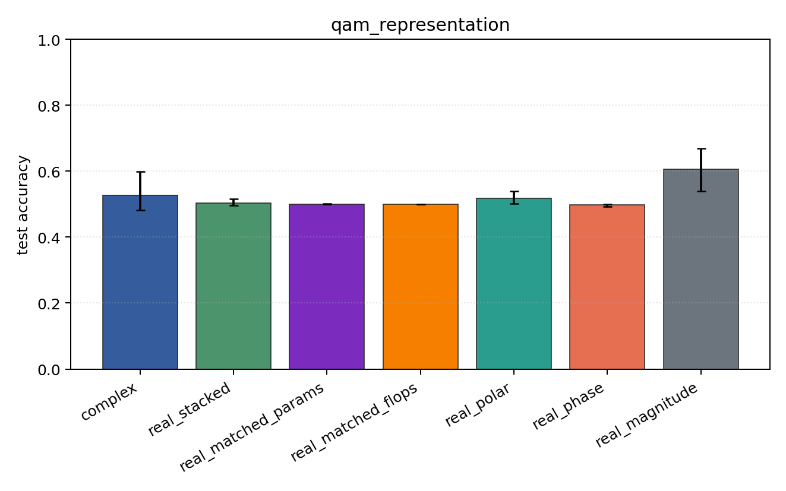
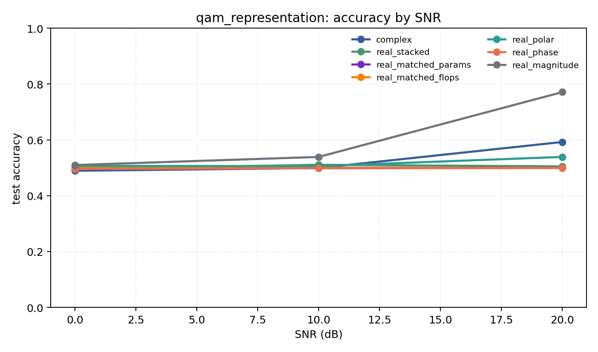

# qam_representation

Question: Does amplitude structure change the story on QAM-only data?

Contradiction signal: magnitude-only becomes competitive, or phase-only collapses relative to Cartesian/polar.

Modulations: `['qam16', 'qam64']`. SNR (dB): `[0, 10, 20]`. Architecture: `conv`. Activation: `crelu`. Train transform: `none`. Test transform: `none`.

## Plots

| model | hidden | params | MAdds | accuracy | std | 95% CI | loss | s/run |
| --- | ---: | ---: | ---: | ---: | ---: | --- | ---: | ---: |
| `complex` | 32 | 10820 | 2703616 | 0.5269 | 0.0773 | [0.4825, 0.5981] | 0.705 | 3.9 |
| `real_stacked` | 32 | 5570 | 696384 | 0.5036 | 0.0128 | [0.4958, 0.5152] | 0.694 | 2.5 |
| `real_matched_params` | 45 | 10757 | 1353690 | 0.5003 | 0.0007 | [0.5000, 0.5010] | 0.693 | 2.1 |
| `real_matched_flops` | 64 | 21378 | 2703488 | 0.5000 | 0.0000 | [0.5000, 0.5000] | 0.693 | 2.2 |
| `real_polar` | 32 | 5730 | 716864 | 0.5172 | 0.0257 | [0.5016, 0.5401] | 0.705 | 1.6 |
| `real_phase` | 32 | 5570 | 696384 | 0.4977 | 0.0051 | [0.4932, 0.5000] | 0.694 | 1.5 |
| `real_magnitude` | 32 | 5410 | 675904 | 0.6065 | 0.0834 | [0.5392, 0.6690] | 0.626 | 1.9 |

## Accuracy by SNR (dB)

| model | 0 dB | 10 dB | 20 dB |
| --- | ---: | ---: | ---: |
| `complex` | 0.489 | 0.499 | 0.592 |
| `real_stacked` | 0.495 | 0.511 | 0.505 |
| `real_matched_params` | 0.501 | 0.500 | 0.500 |
| `real_matched_flops` | 0.500 | 0.500 | 0.500 |
| `real_polar` | 0.507 | 0.506 | 0.539 |
| `real_phase` | 0.496 | 0.498 | 0.499 |
| `real_magnitude` | 0.510 | 0.539 | 0.771 |
