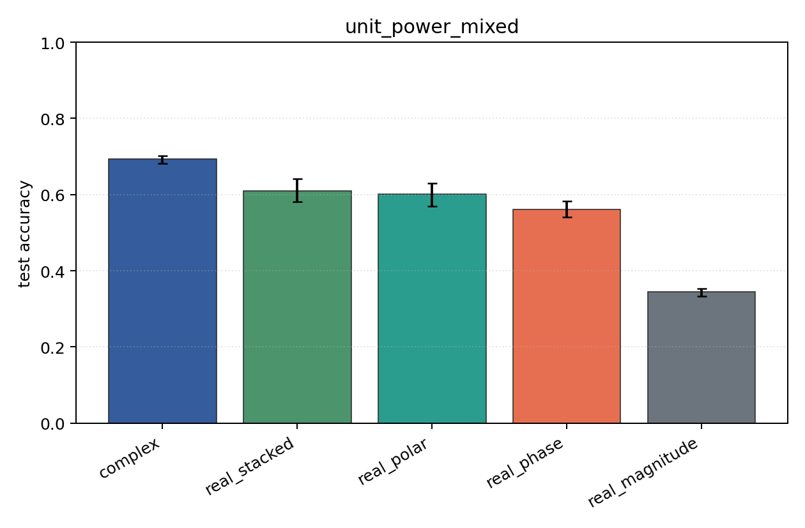
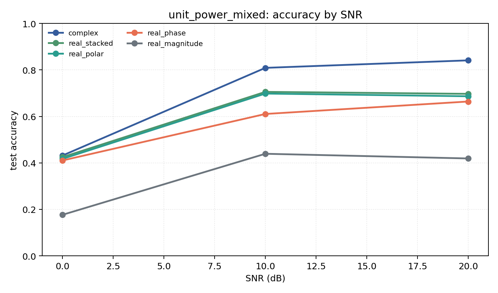

# unit_power_mixed

Question: Does per-example energy normalization change the ranking?

Contradiction signal: rankings change substantially, suggesting models were using energy/SNR scale rather than modulation geometry.

Modulations: `['bpsk', 'qpsk', '8psk', 'qam16', 'qam64']`. SNR (dB): `[0, 10, 20]`. Architecture: `conv`. Activation: `crelu`. Train transform: `unit_power`. Test transform: `unit_power`.

## Plots

| model | hidden | params | MAdds | accuracy | std | 95% CI | loss | s/run |
| --- | ---: | ---: | ---: | ---: | ---: | --- | ---: | ---: |
| `complex` | 32 | 11018 | 2704000 | 0.6940 | 0.0131 | [0.6821, 0.7016] | 0.664 | 4.4 |
| `real_stacked` | 32 | 5669 | 696480 | 0.6092 | 0.0383 | [0.5805, 0.6409] | 0.848 | 2.3 |
| `real_polar` | 32 | 5829 | 716960 | 0.6008 | 0.0399 | [0.5698, 0.6293] | 0.857 | 1.3 |
| `real_phase` | 32 | 5669 | 696480 | 0.5617 | 0.0278 | [0.5401, 0.5829] | 0.944 | 1.6 |
| `real_magnitude` | 32 | 5509 | 676000 | 0.3450 | 0.0129 | [0.3333, 0.3534] | 1.29 | 1.9 |

## Accuracy by SNR (dB)

| model | 0 dB | 10 dB | 20 dB |
| --- | ---: | ---: | ---: |
| `complex` | 0.432 | 0.809 | 0.841 |
| `real_stacked` | 0.425 | 0.706 | 0.697 |
| `real_polar` | 0.417 | 0.698 | 0.687 |
| `real_phase` | 0.410 | 0.610 | 0.664 |
| `real_magnitude` | 0.177 | 0.439 | 0.419 |
