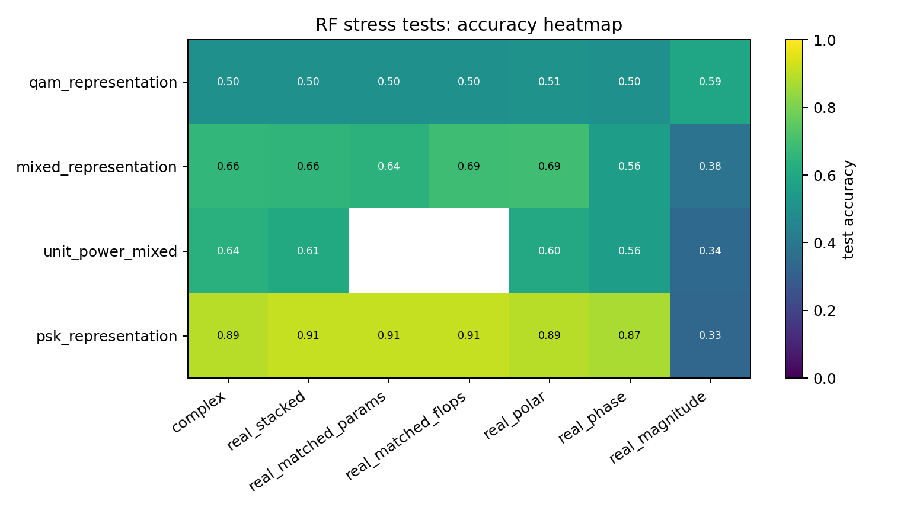
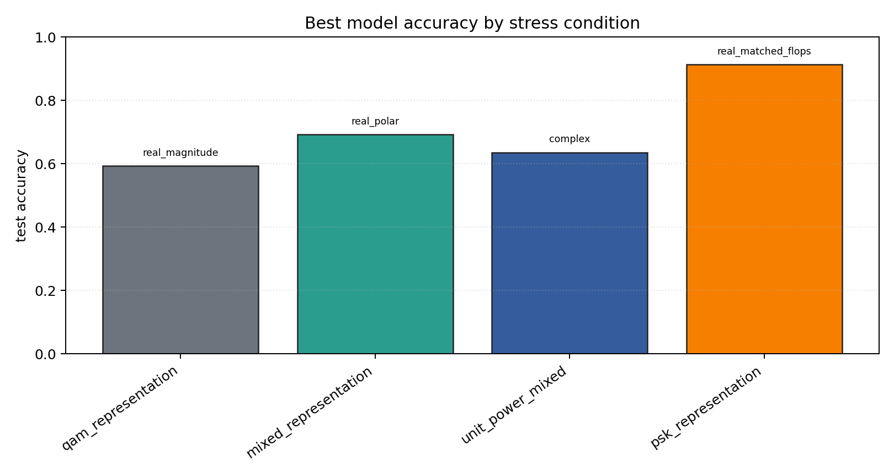

# RF Synthetic Representation Stress Tests

Sequential contradiction tests for whether complex-valued RF models help because of native complex arithmetic, coordinate choice, phase information, augmentation, or compute budget.

## Plots

| condition | best | acc | complex | real_stack | phase | polar | magnitude |
| --- | --- | ---: | ---: | ---: | ---: | ---: | ---: |
| `qam_representation` | `real_magnitude` | 0.5932 | 0.5032 | 0.5000 | 0.5019 | 0.5129 | 0.5932 |
| `mixed_representation` | `real_polar` | 0.6922 | 0.6638 | 0.6561 | 0.5578 | 0.6922 | 0.3803 |
| `unit_power_mixed` | `complex` | 0.6353 | 0.6353 | 0.6076 | 0.5612 | 0.6022 | 0.3434 |
| `psk_representation` | `real_matched_flops` | 0.9133 | 0.8917 | 0.9115 | 0.8723 | 0.8913 | 0.3301 |

Each condition directory contains `raw_runs.json`, `summary.json`, `summary.md`, and `manifest.json`.
