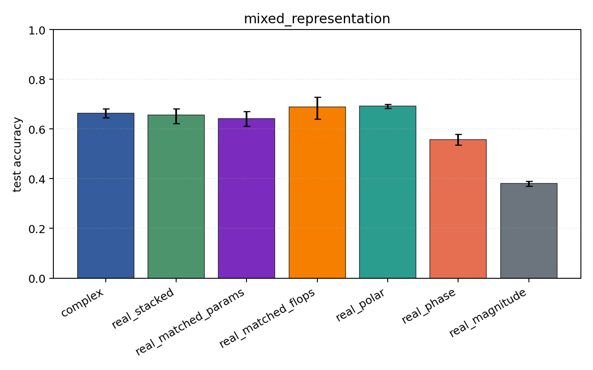
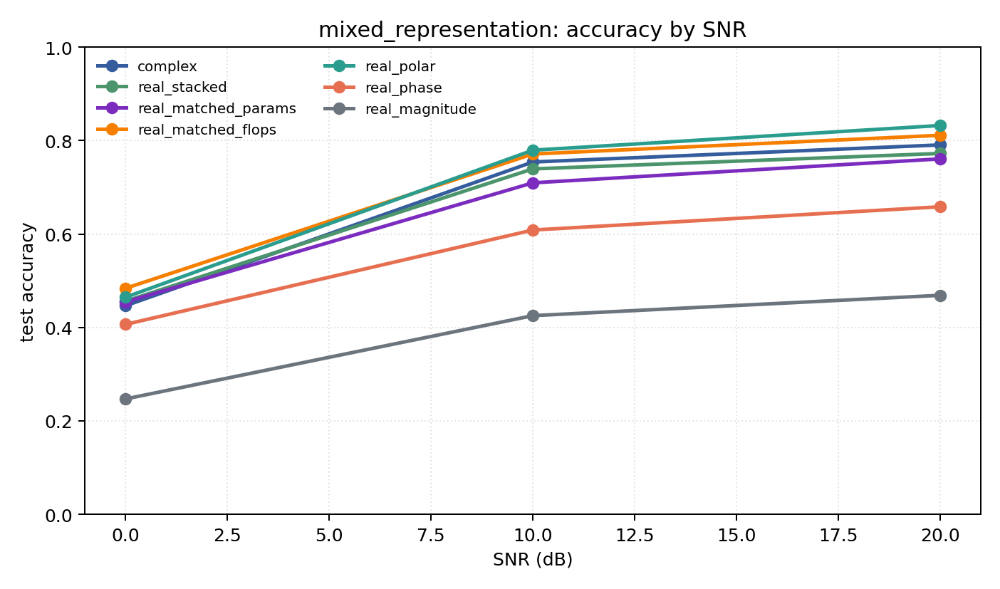

# mixed_representation

Question: Does the representation conclusion survive PSK+QAM together?

Contradiction signal: a hand-chosen real coordinate system matches or beats the complex model over mixed modulation families.

Modulations: `['bpsk', 'qpsk', '8psk', 'qam16', 'qam64']`. SNR (dB): `[0, 10, 20]`. Architecture: `conv`. Activation: `modrelu`. Train transform: `none`. Test transform: `none`.

## Plots

| model | hidden | params | MAdds | accuracy | std | 95% CI | loss | s/run |
| --- | ---: | ---: | ---: | ---: | ---: | --- | ---: | ---: |
| `complex` | 32 | 11020 | 2704000 | 0.6638 | 0.0236 | [0.6457, 0.6814] | 0.712 | 11 |
| `real_stacked` | 32 | 5669 | 696480 | 0.6561 | 0.0423 | [0.6214, 0.6825] | 0.775 | 2.7 |
| `real_matched_params` | 45 | 10895 | 1353825 | 0.6417 | 0.0376 | [0.6117, 0.6717] | 0.81 | 3.1 |
| `real_matched_flops` | 64 | 21573 | 2703680 | 0.6888 | 0.0571 | [0.6406, 0.7278] | 0.682 | 3.2 |
| `real_polar` | 32 | 5829 | 716960 | 0.6922 | 0.0106 | [0.6839, 0.7005] | 0.647 | 2.7 |
| `real_phase` | 32 | 5669 | 696480 | 0.5578 | 0.0268 | [0.5366, 0.5784] | 0.943 | 2.8 |
| `real_magnitude` | 32 | 5509 | 676000 | 0.3803 | 0.0125 | [0.3693, 0.3891] | 1.17 | 2.7 |

## Accuracy by SNR (dB)

| model | 0 dB | 10 dB | 20 dB |
| --- | ---: | ---: | ---: |
| `complex` | 0.447 | 0.754 | 0.791 |
| `real_stacked` | 0.456 | 0.739 | 0.772 |
| `real_matched_params` | 0.455 | 0.710 | 0.761 |
| `real_matched_flops` | 0.484 | 0.771 | 0.811 |
| `real_polar` | 0.465 | 0.779 | 0.832 |
| `real_phase` | 0.407 | 0.609 | 0.658 |
| `real_magnitude` | 0.247 | 0.425 | 0.469 |
