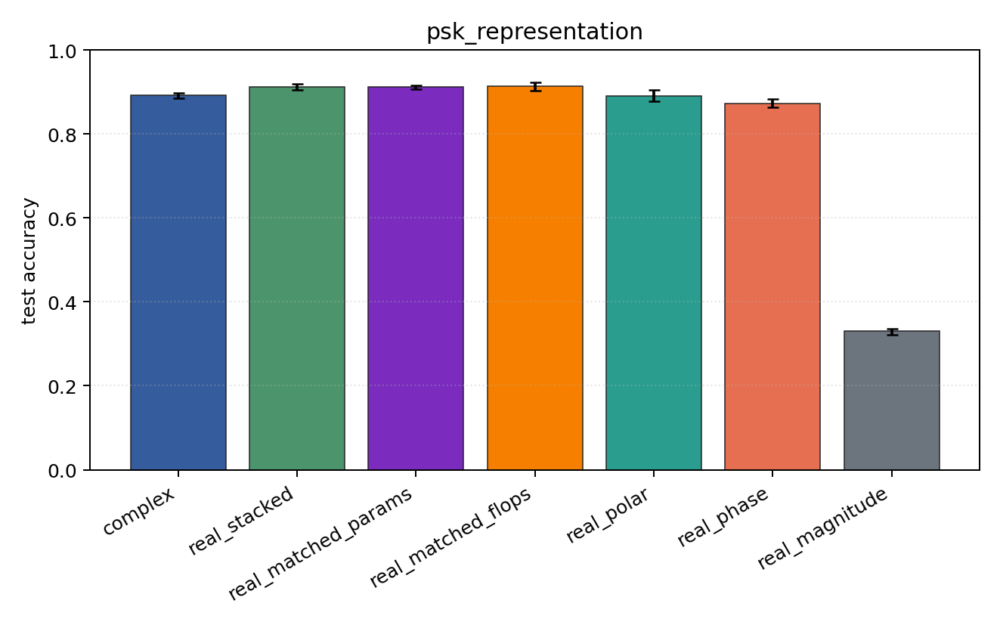
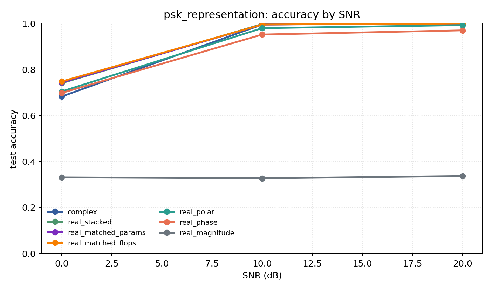

# psk_representation

Question: Do phase-aware encodings explain PSK-family performance?

Contradiction signal: magnitude-only approaches phase/Cartesian accuracy, or real encodings consistently beat complex.

Modulations: `['bpsk', 'qpsk', '8psk']`. SNR (dB): `[0, 10, 20]`. Architecture: `conv`. Activation: `modrelu`. Train transform: `none`. Test transform: `none`.

## Plots

| model | hidden | params | MAdds | accuracy | std | 95% CI | loss | s/run |
| --- | ---: | ---: | ---: | ---: | ---: | --- | ---: | ---: |
| `complex` | 32 | 10888 | 2703744 | 0.8917 | 0.0075 | [0.8859, 0.8977] | 0.223 | 6 |
| `real_stacked` | 32 | 5603 | 696416 | 0.9115 | 0.0099 | [0.9042, 0.9200] | 0.199 | 1 |
| `real_matched_params` | 45 | 10803 | 1353735 | 0.9115 | 0.0058 | [0.9074, 0.9165] | 0.2 | 1.9 |
| `real_matched_flops` | 64 | 21443 | 2703552 | 0.9133 | 0.0132 | [0.9025, 0.9236] | 0.189 | 2.3 |
| `real_polar` | 32 | 5763 | 716896 | 0.8913 | 0.0177 | [0.8775, 0.9046] | 0.233 | 2.3 |
| `real_phase` | 32 | 5603 | 696416 | 0.8723 | 0.0131 | [0.8636, 0.8841] | 0.275 | 1.3 |
| `real_magnitude` | 32 | 5443 | 675936 | 0.3301 | 0.0092 | [0.3217, 0.3353] | 1.1 | 1.5 |

## Accuracy by SNR (dB)

| model | 0 dB | 10 dB | 20 dB |
| --- | ---: | ---: | ---: |
| `complex` | 0.682 | 0.994 | 0.999 |
| `real_stacked` | 0.740 | 0.996 | 0.999 |
| `real_matched_params` | 0.742 | 0.994 | 0.998 |
| `real_matched_flops` | 0.747 | 0.994 | 0.999 |
| `real_polar` | 0.704 | 0.979 | 0.992 |
| `real_phase` | 0.697 | 0.951 | 0.969 |
| `real_magnitude` | 0.329 | 0.326 | 0.335 |
