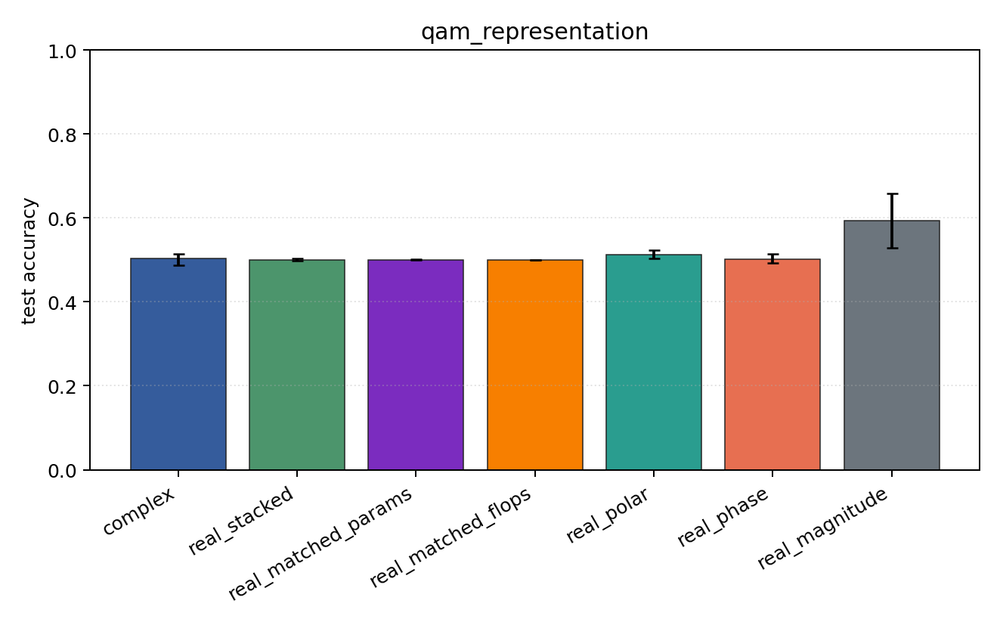
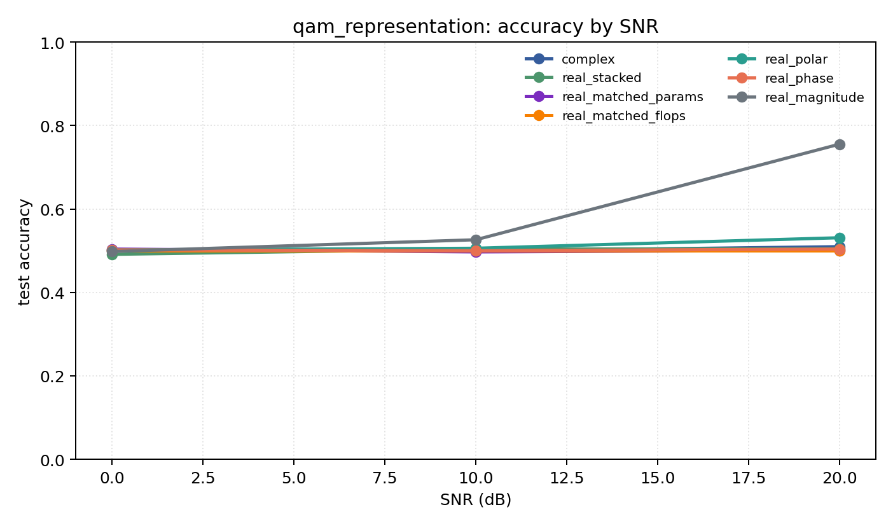

# qam_representation

Question: Does amplitude structure change the story on QAM-only data?

Contradiction signal: magnitude-only becomes competitive, or phase-only collapses relative to Cartesian/polar.

Modulations: `['qam16', 'qam64']`. SNR (dB): `[0, 10, 20]`. Architecture: `conv`. Activation: `modrelu`. Train transform: `none`. Test transform: `none`.

## Plots

| model | hidden | params | MAdds | accuracy | std | 95% CI | loss | s/run |
| --- | ---: | ---: | ---: | ---: | ---: | --- | ---: | ---: |
| `complex` | 32 | 10822 | 2703616 | 0.5032 | 0.0188 | [0.4867, 0.5146] | 0.848 | 10 |
| `real_stacked` | 32 | 5570 | 696384 | 0.5000 | 0.0040 | [0.4974, 0.5032] | 0.694 | 2.8 |
| `real_matched_params` | 45 | 10757 | 1353690 | 0.5006 | 0.0014 | [0.5000, 0.5019] | 0.703 | 3.1 |
| `real_matched_flops` | 64 | 21378 | 2703488 | 0.5000 | 0.0000 | [0.5000, 0.5000] | 0.693 | 2.7 |
| `real_polar` | 32 | 5730 | 716864 | 0.5129 | 0.0140 | [0.5032, 0.5239] | 0.705 | 2.1 |
| `real_phase` | 32 | 5570 | 696384 | 0.5019 | 0.0129 | [0.4922, 0.5136] | 0.694 | 1.9 |
| `real_magnitude` | 32 | 5410 | 675904 | 0.5932 | 0.0860 | [0.5282, 0.6583] | 0.622 | 2 |

## Accuracy by SNR (dB)

| model | 0 dB | 10 dB | 20 dB |
| --- | ---: | ---: | ---: |
| `complex` | 0.501 | 0.499 | 0.510 |
| `real_stacked` | 0.491 | 0.504 | 0.505 |
| `real_matched_params` | 0.504 | 0.497 | 0.501 |
| `real_matched_flops` | 0.500 | 0.500 | 0.500 |
| `real_polar` | 0.502 | 0.506 | 0.531 |
| `real_phase` | 0.502 | 0.500 | 0.504 |
| `real_magnitude` | 0.498 | 0.526 | 0.755 |
