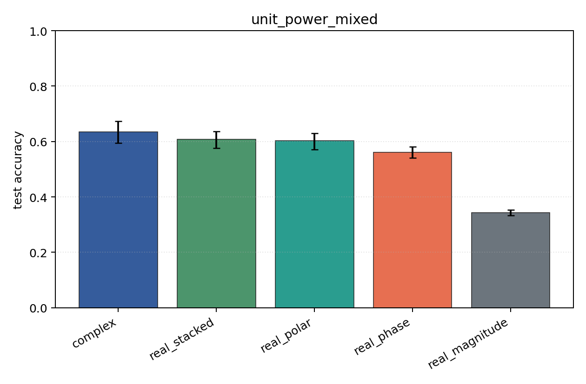
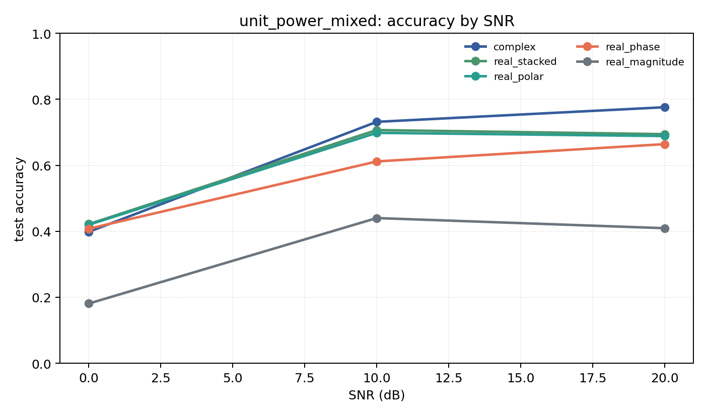

# unit_power_mixed

Question: Does per-example energy normalization change the ranking?

Contradiction signal: rankings change substantially, suggesting models were using energy/SNR scale rather than modulation geometry.

Modulations: `['bpsk', 'qpsk', '8psk', 'qam16', 'qam64']`. SNR (dB): `[0, 10, 20]`. Architecture: `conv`. Activation: `modrelu`. Train transform: `unit_power`. Test transform: `unit_power`.

## Plots

| model | hidden | params | MAdds | accuracy | std | 95% CI | loss | s/run |
| --- | ---: | ---: | ---: | ---: | ---: | --- | ---: | ---: |
| `complex` | 32 | 11020 | 2704000 | 0.6353 | 0.0521 | [0.5944, 0.6733] | 0.805 | 9.2 |
| `real_stacked` | 32 | 5669 | 696480 | 0.6076 | 0.0383 | [0.5757, 0.6372] | 0.844 | 2.2 |
| `real_polar` | 32 | 5829 | 716960 | 0.6022 | 0.0403 | [0.5710, 0.6303] | 0.858 | 1.7 |
| `real_phase` | 32 | 5669 | 696480 | 0.5612 | 0.0261 | [0.5410, 0.5811] | 0.944 | 1.4 |
| `real_magnitude` | 32 | 5509 | 676000 | 0.3434 | 0.0139 | [0.3322, 0.3538] | 1.29 | 1.9 |

## Accuracy by SNR (dB)

| model | 0 dB | 10 dB | 20 dB |
| --- | ---: | ---: | ---: |
| `complex` | 0.398 | 0.732 | 0.776 |
| `real_stacked` | 0.422 | 0.707 | 0.694 |
| `real_polar` | 0.420 | 0.698 | 0.689 |
| `real_phase` | 0.408 | 0.612 | 0.664 |
| `real_magnitude` | 0.181 | 0.440 | 0.409 |
