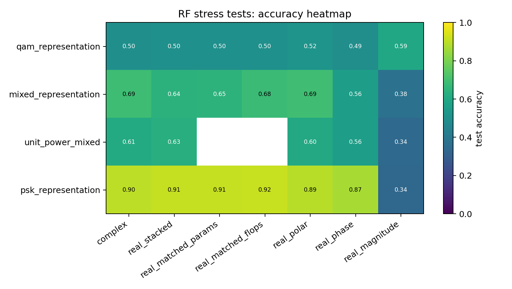
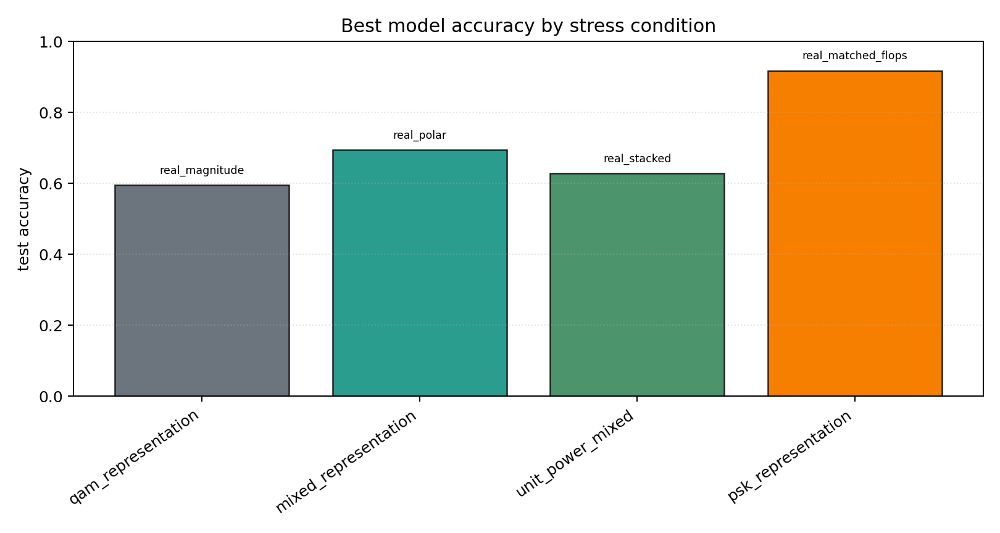

# RF Synthetic Representation Stress Tests

Sequential contradiction tests for whether complex-valued RF models help because of native complex arithmetic, coordinate choice, phase information, augmentation, or compute budget.

## Plots

| condition | best | acc | complex | real_stack | phase | polar | magnitude |
| --- | --- | ---: | ---: | ---: | ---: | ---: | ---: |
| `qam_representation` | `real_magnitude` | 0.5948 | 0.4974 | 0.5026 | 0.4948 | 0.5175 | 0.5948 |
| `mixed_representation` | `real_polar` | 0.6941 | 0.6909 | 0.6440 | 0.5586 | 0.6941 | 0.3767 |
| `unit_power_mixed` | `real_stacked` | 0.6281 | 0.6115 | 0.6281 | 0.5613 | 0.6036 | 0.3432 |
| `psk_representation` | `real_matched_flops` | 0.9176 | 0.9012 | 0.9118 | 0.8708 | 0.8915 | 0.3351 |

Each condition directory contains `raw_runs.json`, `summary.json`, `summary.md`, and `manifest.json`.
