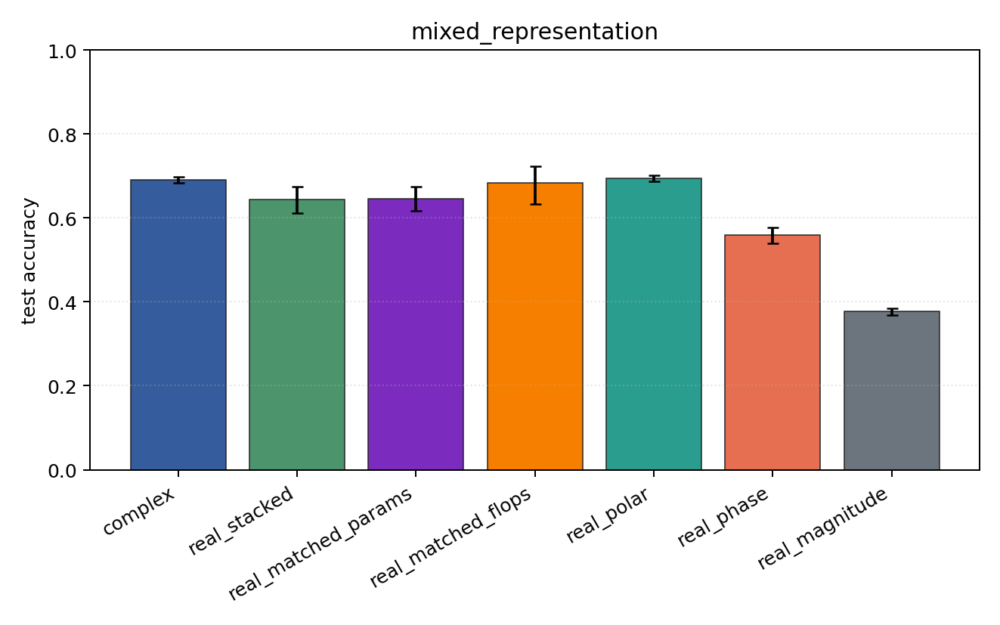
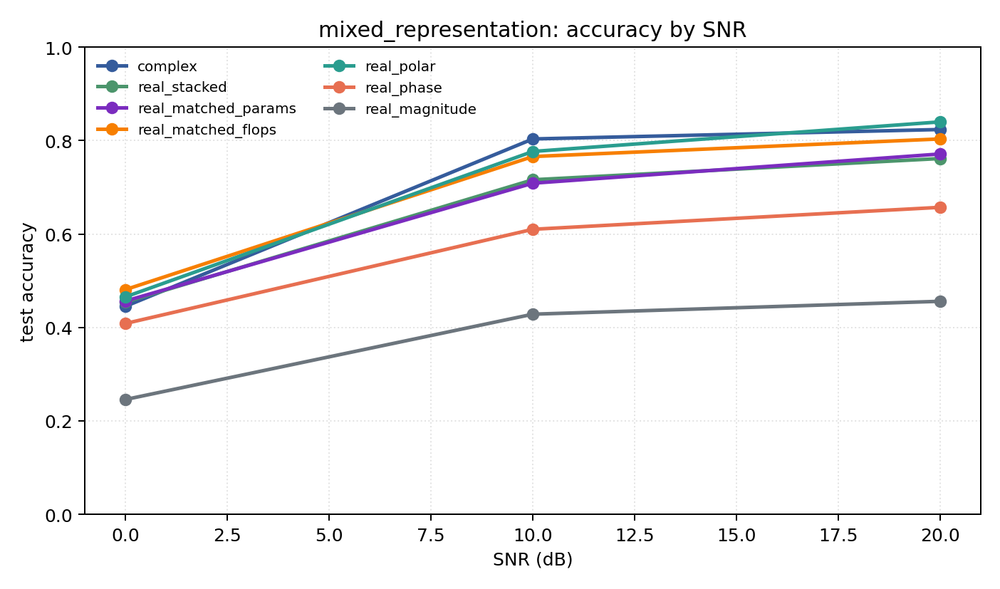

# mixed_representation

Question: Does the representation conclusion survive PSK+QAM together?

Contradiction signal: a hand-chosen real coordinate system matches or beats the complex model over mixed modulation families.

Modulations: `['bpsk', 'qpsk', '8psk', 'qam16', 'qam64']`. SNR (dB): `[0, 10, 20]`. Architecture: `conv`. Activation: `siglog`. Train transform: `none`. Test transform: `none`.

## Plots

| model | hidden | params | MAdds | accuracy | std | 95% CI | loss | s/run |
| --- | ---: | ---: | ---: | ---: | ---: | --- | ---: | ---: |
| `complex` | 32 | 11018 | 2704000 | 0.6909 | 0.0089 | [0.6840, 0.6986] | 0.661 | 4.8 |
| `real_stacked` | 32 | 5669 | 696480 | 0.6440 | 0.0402 | [0.6107, 0.6738] | 0.797 | 1.7 |
| `real_matched_params` | 45 | 10895 | 1353825 | 0.6456 | 0.0387 | [0.6161, 0.6751] | 0.811 | 1.8 |
| `real_matched_flops` | 64 | 21573 | 2703680 | 0.6835 | 0.0596 | [0.6329, 0.7225] | 0.686 | 2 |
| `real_polar` | 32 | 5829 | 716960 | 0.6941 | 0.0097 | [0.6869, 0.7017] | 0.647 | 1.7 |
| `real_phase` | 32 | 5669 | 696480 | 0.5586 | 0.0243 | [0.5397, 0.5772] | 0.946 | 1.4 |
| `real_magnitude` | 32 | 5509 | 676000 | 0.3767 | 0.0099 | [0.3683, 0.3838] | 1.18 | 1.3 |

## Accuracy by SNR (dB)

| model | 0 dB | 10 dB | 20 dB |
| --- | ---: | ---: | ---: |
| `complex` | 0.445 | 0.803 | 0.824 |
| `real_stacked` | 0.454 | 0.716 | 0.762 |
| `real_matched_params` | 0.457 | 0.709 | 0.771 |
| `real_matched_flops` | 0.481 | 0.766 | 0.803 |
| `real_polar` | 0.466 | 0.777 | 0.840 |
| `real_phase` | 0.409 | 0.610 | 0.657 |
| `real_magnitude` | 0.246 | 0.428 | 0.456 |
