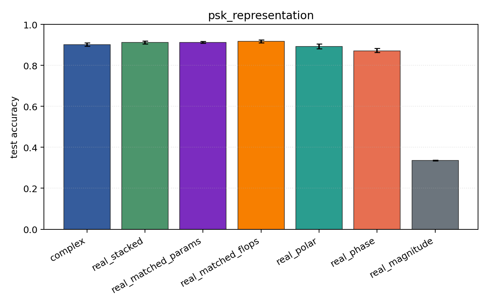
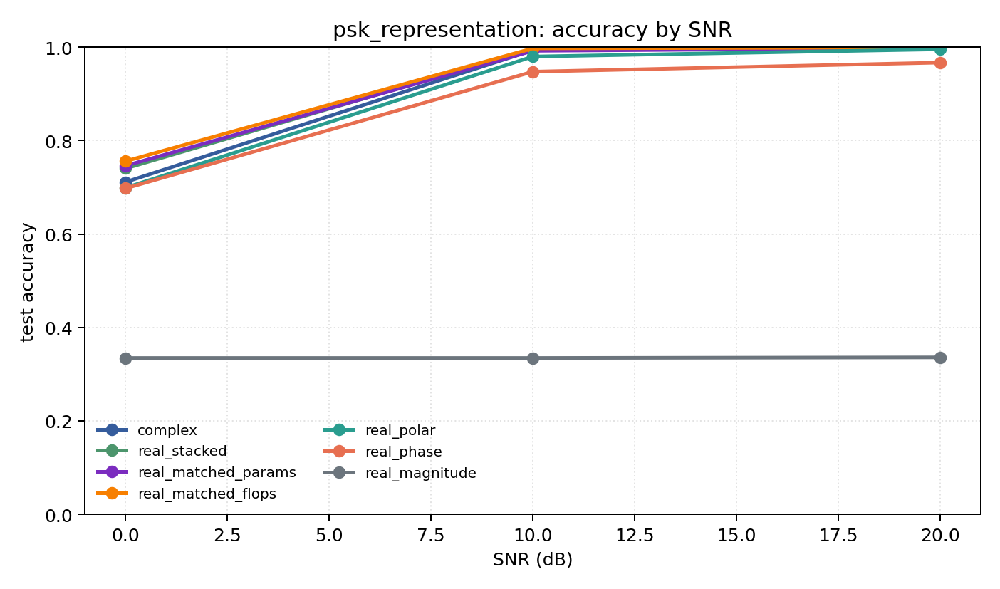

# psk_representation

Question: Do phase-aware encodings explain PSK-family performance?

Contradiction signal: magnitude-only approaches phase/Cartesian accuracy, or real encodings consistently beat complex.

Modulations: `['bpsk', 'qpsk', '8psk']`. SNR (dB): `[0, 10, 20]`. Architecture: `conv`. Activation: `siglog`. Train transform: `none`. Test transform: `none`.

## Plots

| model | hidden | params | MAdds | accuracy | std | 95% CI | loss | s/run |
| --- | ---: | ---: | ---: | ---: | ---: | --- | ---: | ---: |
| `complex` | 32 | 10886 | 2703744 | 0.9012 | 0.0109 | [0.8934, 0.9098] | 0.2 | 4.8 |
| `real_stacked` | 32 | 5603 | 696416 | 0.9118 | 0.0100 | [0.9042, 0.9195] | 0.198 | 1.4 |
| `real_matched_params` | 45 | 10803 | 1353735 | 0.9122 | 0.0056 | [0.9081, 0.9167] | 0.2 | 1.7 |
| `real_matched_flops` | 64 | 21443 | 2703552 | 0.9176 | 0.0089 | [0.9102, 0.9243] | 0.183 | 2.6 |
| `real_polar` | 32 | 5763 | 716896 | 0.8915 | 0.0152 | [0.8816, 0.9044] | 0.231 | 1.7 |
| `real_phase` | 32 | 5603 | 696416 | 0.8708 | 0.0128 | [0.8634, 0.8824] | 0.275 | 1.4 |
| `real_magnitude` | 32 | 5443 | 675936 | 0.3351 | 0.0028 | [0.3333, 0.3376] | 1.1 | 1.6 |

## Accuracy by SNR (dB)

| model | 0 dB | 10 dB | 20 dB |
| --- | ---: | ---: | ---: |
| `complex` | 0.711 | 0.994 | 0.999 |
| `real_stacked` | 0.740 | 0.996 | 0.999 |
| `real_matched_params` | 0.746 | 0.992 | 0.998 |
| `real_matched_flops` | 0.756 | 0.997 | 0.999 |
| `real_polar` | 0.699 | 0.980 | 0.995 |
| `real_phase` | 0.698 | 0.948 | 0.967 |
| `real_magnitude` | 0.335 | 0.335 | 0.336 |
