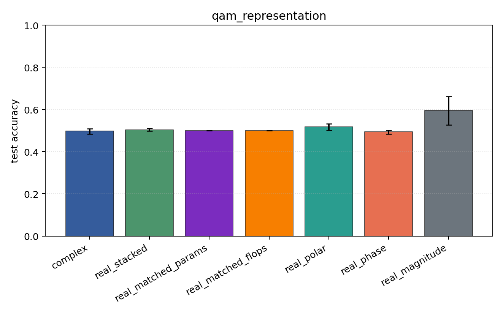
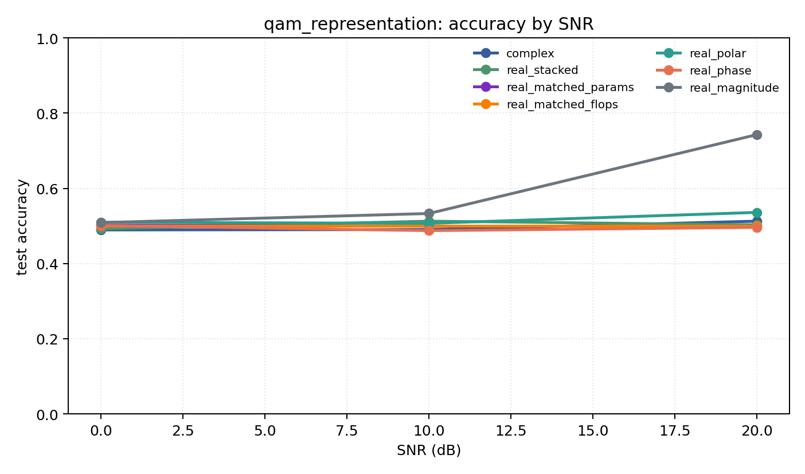

# qam_representation

Question: Does amplitude structure change the story on QAM-only data?

Contradiction signal: magnitude-only becomes competitive, or phase-only collapses relative to Cartesian/polar.

Modulations: `['qam16', 'qam64']`. SNR (dB): `[0, 10, 20]`. Architecture: `conv`. Activation: `siglog`. Train transform: `none`. Test transform: `none`.

## Plots

| model | hidden | params | MAdds | accuracy | std | 95% CI | loss | s/run |
| --- | ---: | ---: | ---: | ---: | ---: | --- | ---: | ---: |
| `complex` | 32 | 10820 | 2703616 | 0.4974 | 0.0160 | [0.4838, 0.5084] | 0.743 | 4.9 |
| `real_stacked` | 32 | 5570 | 696384 | 0.5026 | 0.0077 | [0.4981, 0.5097] | 0.694 | 1.8 |
| `real_matched_params` | 45 | 10757 | 1353690 | 0.5000 | 0.0000 | [0.5000, 0.5000] | 0.693 | 2.3 |
| `real_matched_flops` | 64 | 21378 | 2703488 | 0.5000 | 0.0000 | [0.5000, 0.5000] | 0.693 | 2.9 |
| `real_polar` | 32 | 5730 | 716864 | 0.5175 | 0.0203 | [0.5023, 0.5327] | 0.704 | 2.4 |
| `real_phase` | 32 | 5570 | 696384 | 0.4948 | 0.0125 | [0.4835, 0.5010] | 0.694 | 2.2 |
| `real_magnitude` | 32 | 5410 | 675904 | 0.5948 | 0.0896 | [0.5275, 0.6622] | 0.624 | 1.2 |

## Accuracy by SNR (dB)

| model | 0 dB | 10 dB | 20 dB |
| --- | ---: | ---: | ---: |
| `complex` | 0.489 | 0.490 | 0.513 |
| `real_stacked` | 0.492 | 0.513 | 0.503 |
| `real_matched_params` | 0.502 | 0.499 | 0.499 |
| `real_matched_flops` | 0.500 | 0.500 | 0.500 |
| `real_polar` | 0.510 | 0.507 | 0.536 |
| `real_phase` | 0.501 | 0.487 | 0.496 |
| `real_magnitude` | 0.509 | 0.533 | 0.743 |
