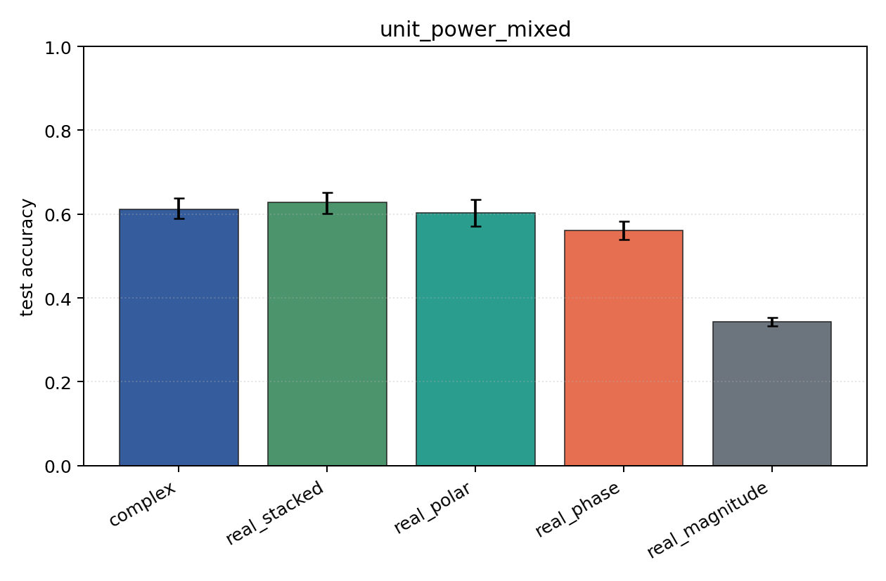
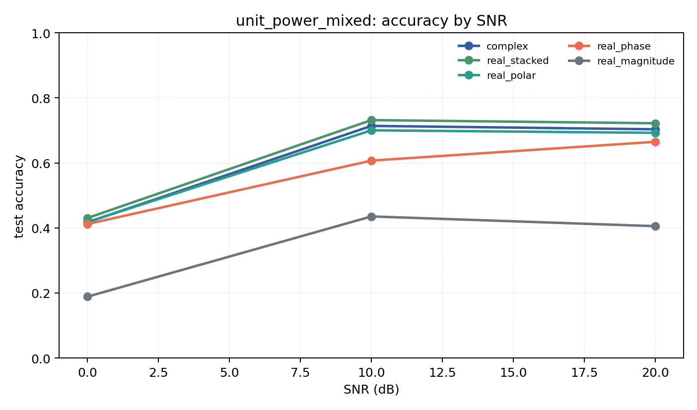

# unit_power_mixed

Question: Does per-example energy normalization change the ranking?

Contradiction signal: rankings change substantially, suggesting models were using energy/SNR scale rather than modulation geometry.

Modulations: `['bpsk', 'qpsk', '8psk', 'qam16', 'qam64']`. SNR (dB): `[0, 10, 20]`. Architecture: `conv`. Activation: `siglog`. Train transform: `unit_power`. Test transform: `unit_power`.

## Plots

| model | hidden | params | MAdds | accuracy | std | 95% CI | loss | s/run |
| --- | ---: | ---: | ---: | ---: | ---: | --- | ---: | ---: |
| `complex` | 32 | 11018 | 2704000 | 0.6115 | 0.0311 | [0.5894, 0.6383] | 0.833 | 4.4 |
| `real_stacked` | 32 | 5669 | 696480 | 0.6281 | 0.0332 | [0.6010, 0.6522] | 0.834 | 1.2 |
| `real_polar` | 32 | 5829 | 716960 | 0.6036 | 0.0429 | [0.5707, 0.6346] | 0.857 | 1 |
| `real_phase` | 32 | 5669 | 696480 | 0.5613 | 0.0287 | [0.5386, 0.5832] | 0.943 | 1.5 |
| `real_magnitude` | 32 | 5509 | 676000 | 0.3432 | 0.0145 | [0.3322, 0.3538] | 1.29 | 1.6 |

## Accuracy by SNR (dB)

| model | 0 dB | 10 dB | 20 dB |
| --- | ---: | ---: | ---: |
| `complex` | 0.417 | 0.714 | 0.703 |
| `real_stacked` | 0.431 | 0.732 | 0.722 |
| `real_polar` | 0.418 | 0.700 | 0.692 |
| `real_phase` | 0.412 | 0.607 | 0.665 |
| `real_magnitude` | 0.189 | 0.435 | 0.405 |
