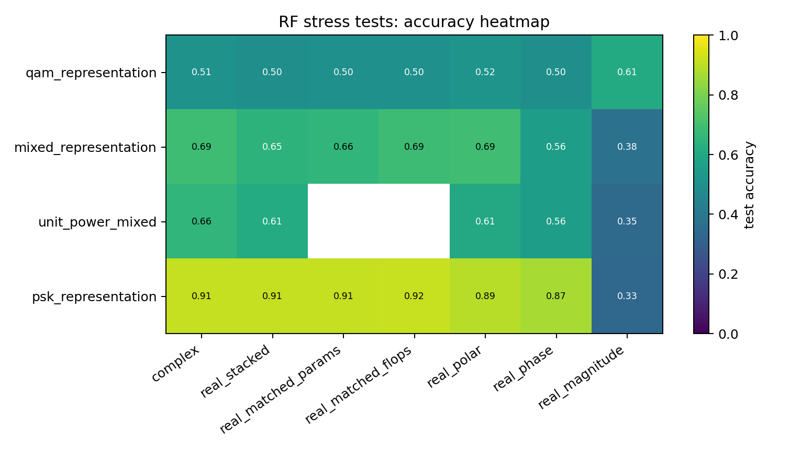
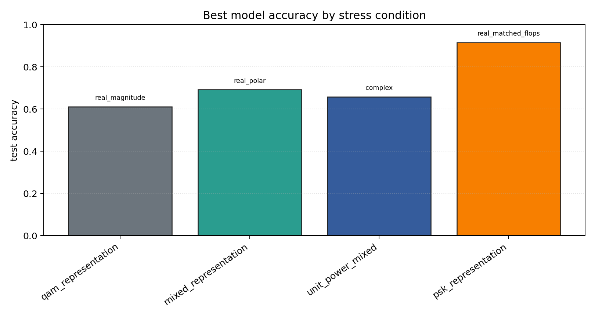

# RF Synthetic Representation Stress Tests

Sequential contradiction tests for whether complex-valued RF models help because of native complex arithmetic, coordinate choice, phase information, augmentation, or compute budget.

## Plots

| condition | best | acc | complex | real_stack | phase | polar | magnitude |
| --- | --- | ---: | ---: | ---: | ---: | ---: | ---: |
| `qam_representation` | `real_magnitude` | 0.6113 | 0.5107 | 0.4990 | 0.4994 | 0.5162 | 0.6113 |
| `mixed_representation` | `real_polar` | 0.6924 | 0.6894 | 0.6457 | 0.5596 | 0.6924 | 0.3761 |
| `unit_power_mixed` | `complex` | 0.6584 | 0.6584 | 0.6141 | 0.5621 | 0.6053 | 0.3454 |
| `psk_representation` | `real_matched_flops` | 0.9154 | 0.9111 | 0.9118 | 0.8706 | 0.8932 | 0.3327 |

Each condition directory contains `raw_runs.json`, `summary.json`, `summary.md`, and `manifest.json`.
