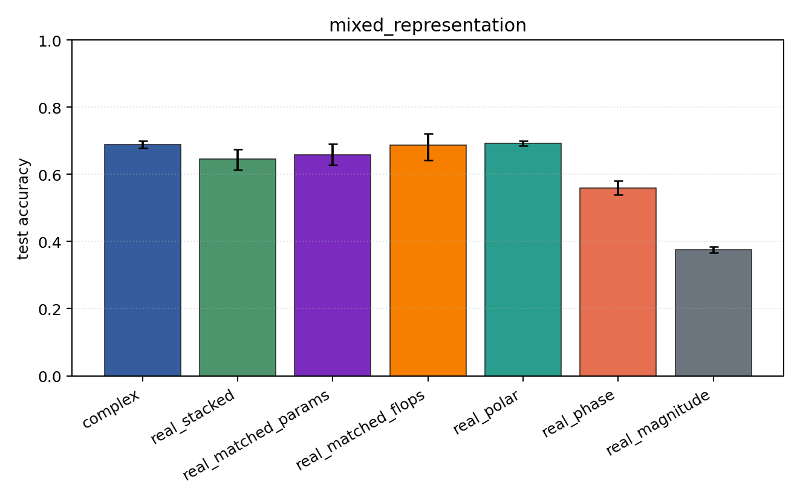
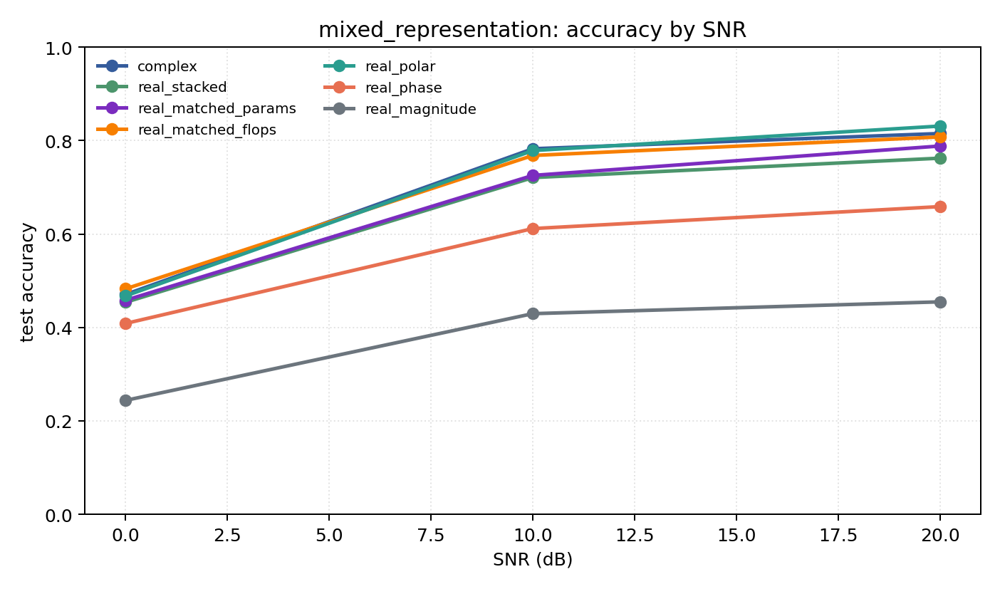

# mixed_representation

Question: Does the representation conclusion survive PSK+QAM together?

Contradiction signal: a hand-chosen real coordinate system matches or beats the complex model over mixed modulation families.

Modulations: `['bpsk', 'qpsk', '8psk', 'qam16', 'qam64']`. SNR (dB): `[0, 10, 20]`. Architecture: `conv`. Activation: `zrelu`. Train transform: `none`. Test transform: `none`.

## Plots

| model | hidden | params | MAdds | accuracy | std | 95% CI | loss | s/run |
| --- | ---: | ---: | ---: | ---: | ---: | --- | ---: | ---: |
| `complex` | 32 | 11018 | 2704000 | 0.6894 | 0.0146 | [0.6774, 0.7005] | 0.697 | 3.2 |
| `real_stacked` | 32 | 5669 | 696480 | 0.6457 | 0.0399 | [0.6133, 0.6752] | 0.794 | 1.4 |
| `real_matched_params` | 45 | 10895 | 1353825 | 0.6573 | 0.0405 | [0.6282, 0.6915] | 0.786 | 1.4 |
| `real_matched_flops` | 64 | 21573 | 2703680 | 0.6862 | 0.0528 | [0.6419, 0.7217] | 0.683 | 1.3 |
| `real_polar` | 32 | 5829 | 716960 | 0.6924 | 0.0096 | [0.6852, 0.6998] | 0.647 | 0.57 |
| `real_phase` | 32 | 5669 | 696480 | 0.5596 | 0.0274 | [0.5389, 0.5799] | 0.941 | 1.1 |
| `real_magnitude` | 32 | 5509 | 676000 | 0.3761 | 0.0104 | [0.3674, 0.3841] | 1.18 | 2.8 |

## Accuracy by SNR (dB)

| model | 0 dB | 10 dB | 20 dB |
| --- | ---: | ---: | ---: |
| `complex` | 0.471 | 0.783 | 0.815 |
| `real_stacked` | 0.454 | 0.721 | 0.762 |
| `real_matched_params` | 0.458 | 0.725 | 0.788 |
| `real_matched_flops` | 0.483 | 0.768 | 0.808 |
| `real_polar` | 0.468 | 0.779 | 0.831 |
| `real_phase` | 0.409 | 0.612 | 0.659 |
| `real_magnitude` | 0.244 | 0.430 | 0.455 |
