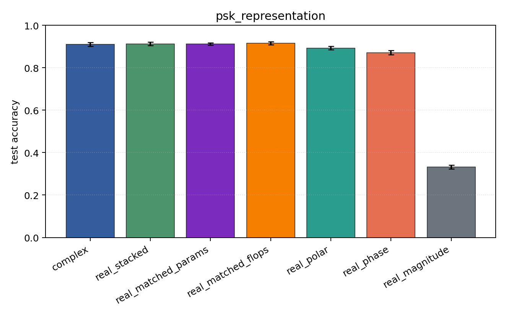
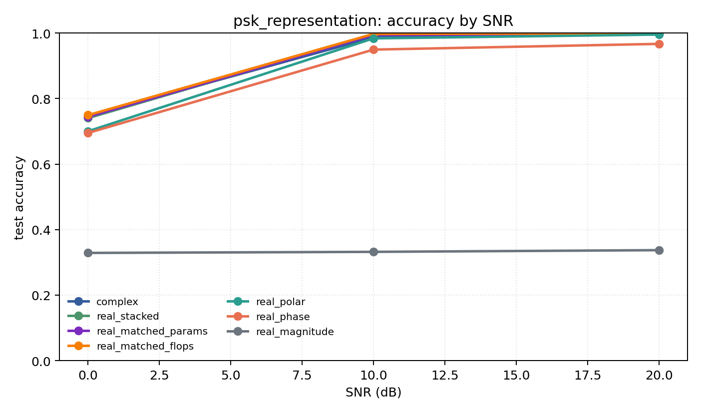

# psk_representation

Question: Do phase-aware encodings explain PSK-family performance?

Contradiction signal: magnitude-only approaches phase/Cartesian accuracy, or real encodings consistently beat complex.

Modulations: `['bpsk', 'qpsk', '8psk']`. SNR (dB): `[0, 10, 20]`. Architecture: `conv`. Activation: `zrelu`. Train transform: `none`. Test transform: `none`.

## Plots

| model | hidden | params | MAdds | accuracy | std | 95% CI | loss | s/run |
| --- | ---: | ---: | ---: | ---: | ---: | --- | ---: | ---: |
| `complex` | 32 | 10886 | 2703744 | 0.9111 | 0.0114 | [0.9020, 0.9202] | 0.205 | 5.3 |
| `real_stacked` | 32 | 5603 | 696416 | 0.9118 | 0.0104 | [0.9042, 0.9206] | 0.198 | 2.4 |
| `real_matched_params` | 45 | 10803 | 1353735 | 0.9122 | 0.0068 | [0.9072, 0.9178] | 0.201 | 2.7 |
| `real_matched_flops` | 64 | 21443 | 2703552 | 0.9154 | 0.0090 | [0.9081, 0.9221] | 0.185 | 2.8 |
| `real_polar` | 32 | 5763 | 716896 | 0.8932 | 0.0108 | [0.8859, 0.9018] | 0.224 | 2.8 |
| `real_phase` | 32 | 5603 | 696416 | 0.8706 | 0.0129 | [0.8621, 0.8822] | 0.276 | 3 |
| `real_magnitude` | 32 | 5443 | 675936 | 0.3327 | 0.0111 | [0.3230, 0.3417] | 1.1 | 3 |

## Accuracy by SNR (dB)

| model | 0 dB | 10 dB | 20 dB |
| --- | ---: | ---: | ---: |
| `complex` | 0.747 | 0.987 | 0.999 |
| `real_stacked` | 0.740 | 0.996 | 0.999 |
| `real_matched_params` | 0.744 | 0.994 | 0.998 |
| `real_matched_flops` | 0.750 | 0.997 | 0.999 |
| `real_polar` | 0.700 | 0.984 | 0.995 |
| `real_phase` | 0.695 | 0.950 | 0.967 |
| `real_magnitude` | 0.329 | 0.332 | 0.337 |
