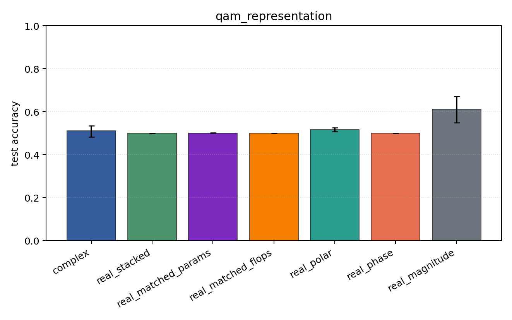
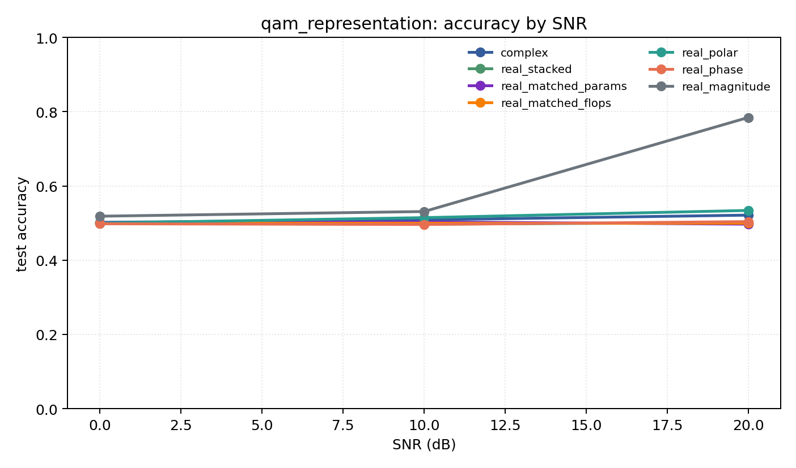

# qam_representation

Question: Does amplitude structure change the story on QAM-only data?

Contradiction signal: magnitude-only becomes competitive, or phase-only collapses relative to Cartesian/polar.

Modulations: `['qam16', 'qam64']`. SNR (dB): `[0, 10, 20]`. Architecture: `conv`. Activation: `zrelu`. Train transform: `none`. Test transform: `none`.

## Plots

| model | hidden | params | MAdds | accuracy | std | 95% CI | loss | s/run |
| --- | ---: | ---: | ---: | ---: | ---: | --- | ---: | ---: |
| `complex` | 32 | 10820 | 2703616 | 0.5107 | 0.0342 | [0.4812, 0.5343] | 0.815 | 5.5 |
| `real_stacked` | 32 | 5570 | 696384 | 0.4990 | 0.0022 | [0.4971, 0.5000] | 0.694 | 1.3 |
| `real_matched_params` | 45 | 10757 | 1353690 | 0.5003 | 0.0007 | [0.5000, 0.5010] | 0.694 | 2.1 |
| `real_matched_flops` | 64 | 21378 | 2703488 | 0.5000 | 0.0000 | [0.5000, 0.5000] | 0.693 | 1.6 |
| `real_polar` | 32 | 5730 | 716864 | 0.5162 | 0.0114 | [0.5071, 0.5246] | 0.705 | 0.78 |
| `real_phase` | 32 | 5570 | 696384 | 0.4994 | 0.0009 | [0.4987, 0.5000] | 0.694 | 0.81 |
| `real_magnitude` | 32 | 5410 | 675904 | 0.6113 | 0.0794 | [0.5476, 0.6712] | 0.622 | 1.1 |

## Accuracy by SNR (dB)

| model | 0 dB | 10 dB | 20 dB |
| --- | ---: | ---: | ---: |
| `complex` | 0.502 | 0.509 | 0.521 |
| `real_stacked` | 0.499 | 0.497 | 0.501 |
| `real_matched_params` | 0.501 | 0.503 | 0.497 |
| `real_matched_flops` | 0.500 | 0.500 | 0.500 |
| `real_polar` | 0.500 | 0.515 | 0.534 |
| `real_phase` | 0.498 | 0.496 | 0.504 |
| `real_magnitude` | 0.518 | 0.531 | 0.784 |
