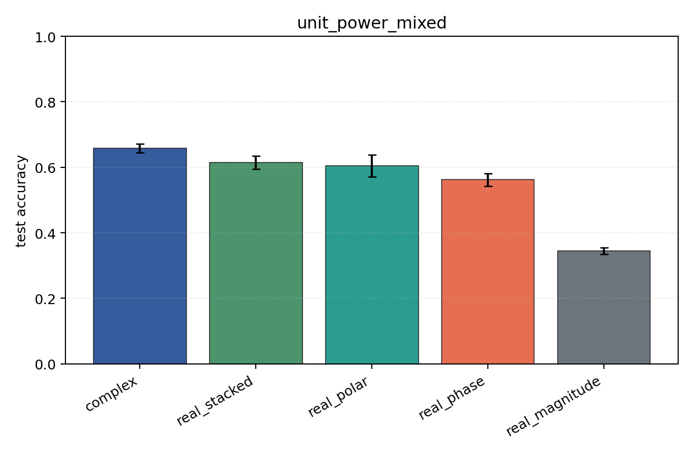
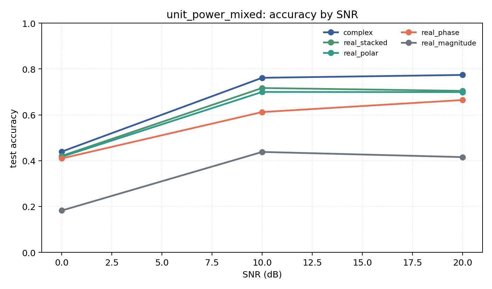

# unit_power_mixed

Question: Does per-example energy normalization change the ranking?

Contradiction signal: rankings change substantially, suggesting models were using energy/SNR scale rather than modulation geometry.

Modulations: `['bpsk', 'qpsk', '8psk', 'qam16', 'qam64']`. SNR (dB): `[0, 10, 20]`. Architecture: `conv`. Activation: `zrelu`. Train transform: `unit_power`. Test transform: `unit_power`.

## Plots

| model | hidden | params | MAdds | accuracy | std | 95% CI | loss | s/run |
| --- | ---: | ---: | ---: | ---: | ---: | --- | ---: | ---: |
| `complex` | 32 | 11018 | 2704000 | 0.6584 | 0.0172 | [0.6453, 0.6715] | 0.753 | 5.3 |
| `real_stacked` | 32 | 5669 | 696480 | 0.6141 | 0.0252 | [0.5951, 0.6347] | 0.843 | 2.8 |
| `real_polar` | 32 | 5829 | 716960 | 0.6053 | 0.0443 | [0.5718, 0.6387] | 0.858 | 2.1 |
| `real_phase` | 32 | 5669 | 696480 | 0.5621 | 0.0258 | [0.5425, 0.5816] | 0.943 | 2.2 |
| `real_magnitude` | 32 | 5509 | 676000 | 0.3454 | 0.0131 | [0.3340, 0.3540] | 1.29 | 2.8 |

## Accuracy by SNR (dB)

| model | 0 dB | 10 dB | 20 dB |
| --- | ---: | ---: | ---: |
| `complex` | 0.440 | 0.762 | 0.774 |
| `real_stacked` | 0.421 | 0.717 | 0.704 |
| `real_polar` | 0.417 | 0.700 | 0.699 |
| `real_phase` | 0.410 | 0.612 | 0.664 |
| `real_magnitude` | 0.183 | 0.438 | 0.416 |
