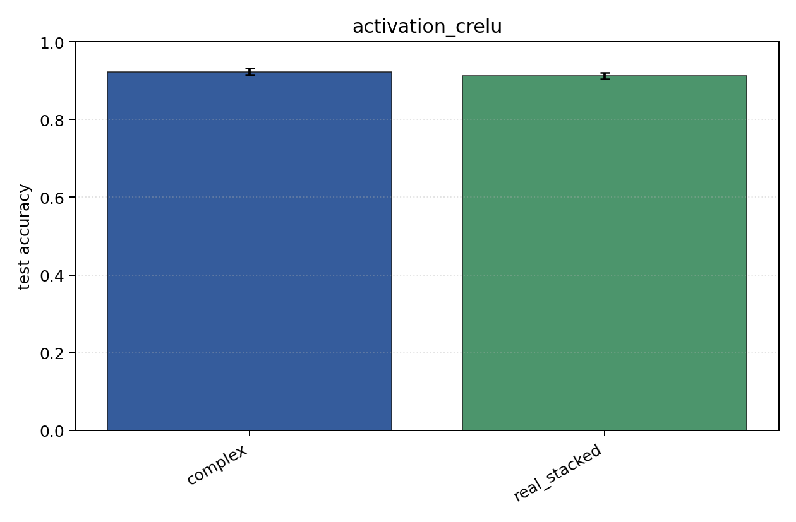
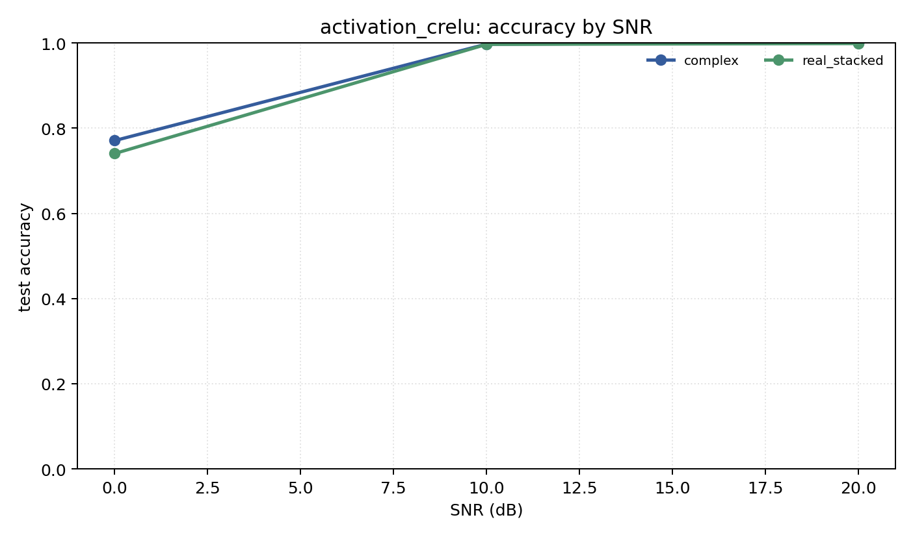

# activation_crelu

Question: How much does complex activation `crelu` matter?

Contradiction signal: the complex result changes enough across activations that the broad 'complex NN' claim is underspecified.

Modulations: `['bpsk', 'qpsk', '8psk']`. SNR (dB): `[0, 10, 20]`. Architecture: `conv`. Activation: `crelu`. Train transform: `none`. Test transform: `none`.

## Plots

| model | hidden | params | MAdds | accuracy | std | 95% CI | loss | s/run |
| --- | ---: | ---: | ---: | ---: | ---: | --- | ---: | ---: |
| `complex` | 32 | 10886 | 2703744 | 0.9228 | 0.0120 | [0.9139, 0.9316] | 0.171 | 5 |
| `real_stacked` | 32 | 5603 | 696416 | 0.9120 | 0.0094 | [0.9051, 0.9200] | 0.198 | 1.1 |

## Accuracy by SNR (dB)

| model | 0 dB | 10 dB | 20 dB |
| --- | ---: | ---: | ---: |
| `complex` | 0.771 | 0.997 | 1.000 |
| `real_stacked` | 0.740 | 0.997 | 0.999 |
