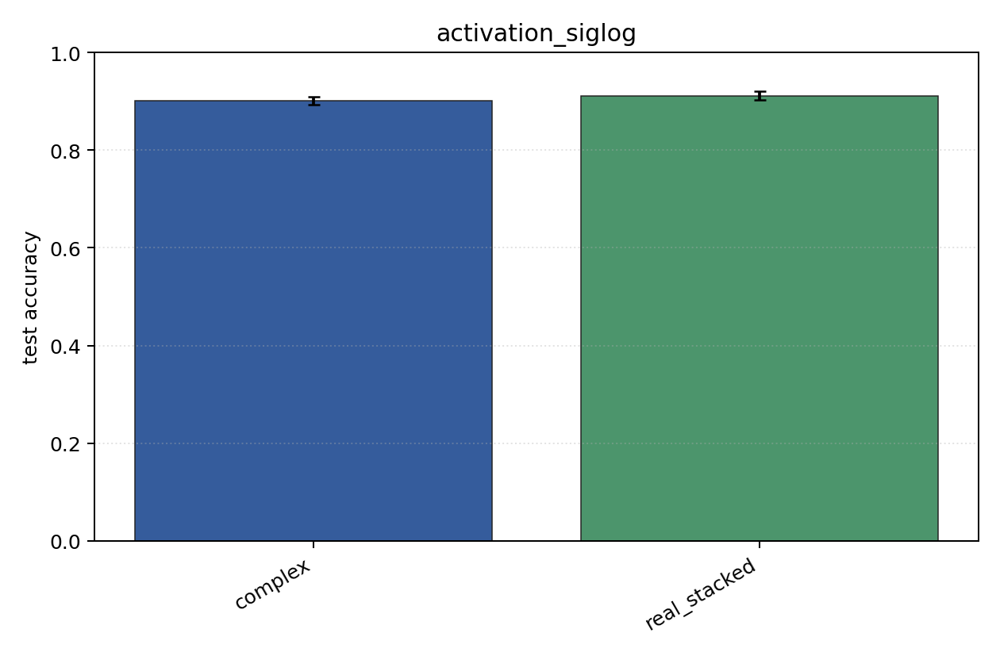
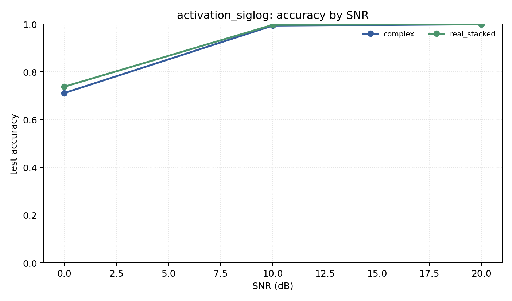

# activation_siglog

Question: How much does complex activation `siglog` matter?

Contradiction signal: the complex result changes enough across activations that the broad 'complex NN' claim is underspecified.

Modulations: `['bpsk', 'qpsk', '8psk']`. SNR (dB): `[0, 10, 20]`. Architecture: `conv`. Activation: `siglog`. Train transform: `none`. Test transform: `none`.

## Plots

| model | hidden | params | MAdds | accuracy | std | 95% CI | loss | s/run |
| --- | ---: | ---: | ---: | ---: | ---: | --- | ---: | ---: |
| `complex` | 32 | 10886 | 2703744 | 0.9012 | 0.0109 | [0.8934, 0.9098] | 0.2 | 3.5 |
| `real_stacked` | 32 | 5603 | 696416 | 0.9111 | 0.0110 | [0.9029, 0.9202] | 0.197 | 1 |

## Accuracy by SNR (dB)

| model | 0 dB | 10 dB | 20 dB |
| --- | ---: | ---: | ---: |
| `complex` | 0.711 | 0.994 | 0.999 |
| `real_stacked` | 0.738 | 0.997 | 0.999 |
