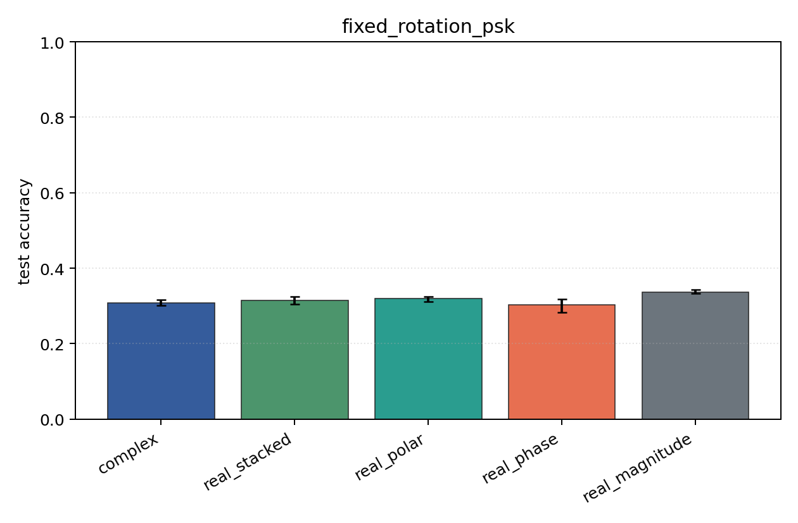
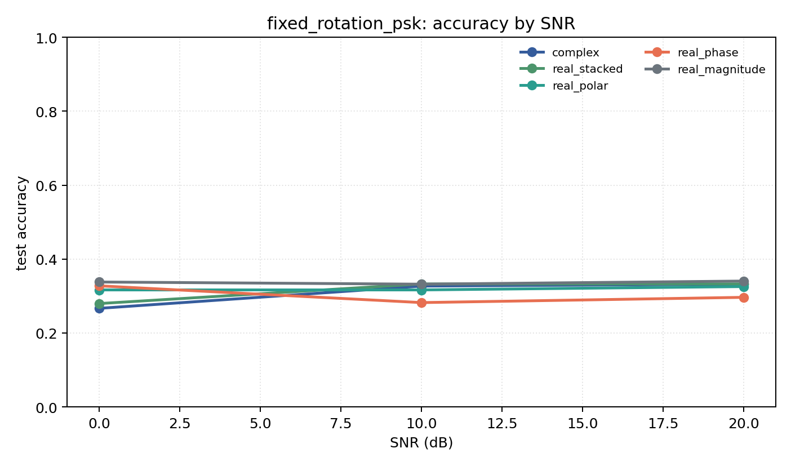

# fixed_rotation_psk

Question: Are models robust to an unseen global carrier phase offset?

Contradiction signal: all coordinate-dependent models fail under a fixed test rotation, weakening claims about native phase handling.

Modulations: `['bpsk', 'qpsk', '8psk']`. SNR (dB): `[0, 10, 20]`. Architecture: `conv`. Activation: `zrelu`. Train transform: `none`. Test transform: `fixed_rotation`.

## Plots

| model | hidden | params | MAdds | accuracy | std | 95% CI | loss | s/run |
| --- | ---: | ---: | ---: | ---: | ---: | --- | ---: | ---: |
| `complex` | 32 | 10886 | 2703744 | 0.3085 | 0.0085 | [0.3018, 0.3156] | 5 | 4.4 |
| `real_stacked` | 32 | 5603 | 696416 | 0.3150 | 0.0134 | [0.3040, 0.3249] | 6.8 | 1.3 |
| `real_polar` | 32 | 5763 | 716896 | 0.3195 | 0.0096 | [0.3111, 0.3254] | 6.48 | 1.9 |
| `real_phase` | 32 | 5603 | 696416 | 0.3020 | 0.0212 | [0.2831, 0.3172] | 6.78 | 2.3 |
| `real_magnitude` | 32 | 5443 | 675936 | 0.3368 | 0.0077 | [0.3333, 0.3437] | 1.1 | 2.2 |

## Accuracy by SNR (dB)

| model | 0 dB | 10 dB | 20 dB |
| --- | ---: | ---: | ---: |
| `complex` | 0.267 | 0.327 | 0.332 |
| `real_stacked` | 0.280 | 0.333 | 0.333 |
| `real_polar` | 0.317 | 0.317 | 0.326 |
| `real_phase` | 0.328 | 0.282 | 0.296 |
| `real_magnitude` | 0.338 | 0.332 | 0.340 |
