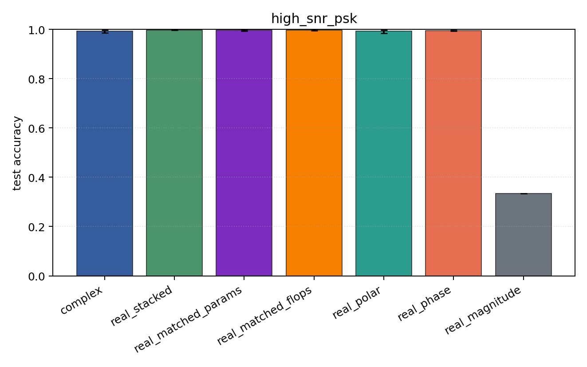
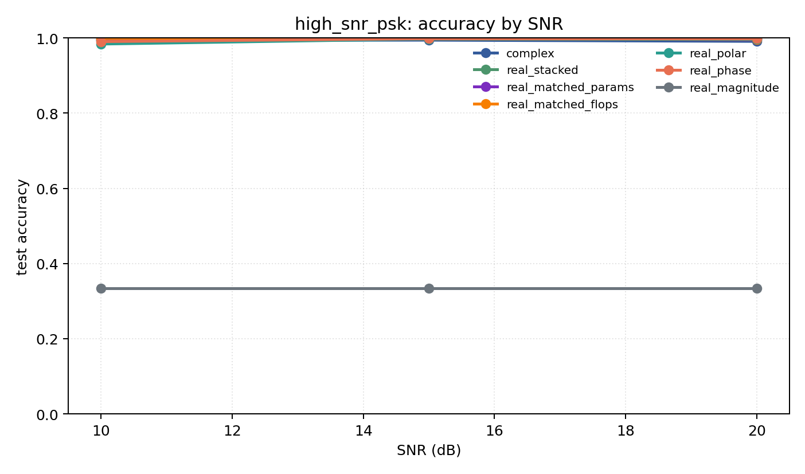

# high_snr_psk

Question: Is the complex advantage only a high-SNR effect?

Contradiction signal: complex only separates from real baselines when the phase estimate is clean.

Modulations: `['bpsk', 'qpsk', '8psk']`. SNR (dB): `[10, 15, 20]`. Architecture: `conv`. Activation: `zrelu`. Train transform: `none`. Test transform: `none`.

## Plots

| model | hidden | params | MAdds | accuracy | std | 95% CI | loss | s/run |
| --- | ---: | ---: | ---: | ---: | ---: | --- | ---: | ---: |
| `complex` | 32 | 10886 | 2703744 | 0.9929 | 0.0077 | [0.9858, 0.9972] | 0.0168 | 2.4 |
| `real_stacked` | 32 | 5603 | 696416 | 0.9972 | 0.0018 | [0.9959, 0.9987] | 0.01 | 0.55 |
| `real_matched_params` | 45 | 10803 | 1353735 | 0.9970 | 0.0039 | [0.9933, 0.9994] | 0.0115 | 0.87 |
| `real_matched_flops` | 64 | 21443 | 2703552 | 0.9974 | 0.0031 | [0.9948, 0.9996] | 0.00892 | 1.9 |
| `real_polar` | 32 | 5763 | 716896 | 0.9927 | 0.0088 | [0.9849, 0.9976] | 0.0227 | 2 |
| `real_phase` | 32 | 5603 | 696416 | 0.9955 | 0.0026 | [0.9935, 0.9976] | 0.0143 | 2.1 |
| `real_magnitude` | 32 | 5443 | 675936 | 0.3333 | 0.0000 | [0.3333, 0.3333] | 1.1 | 2.1 |

## Accuracy by SNR (dB)

| model | 10 dB | 15 dB | 20 dB |
| --- | ---: | ---: | ---: |
| `complex` | 0.994 | 0.994 | 0.991 |
| `real_stacked` | 0.994 | 0.999 | 0.999 |
| `real_matched_params` | 0.997 | 0.999 | 0.995 |
| `real_matched_flops` | 0.999 | 0.997 | 0.996 |
| `real_polar` | 0.984 | 0.997 | 0.997 |
| `real_phase` | 0.990 | 0.998 | 0.998 |
| `real_magnitude` | 0.333 | 0.333 | 0.333 |
