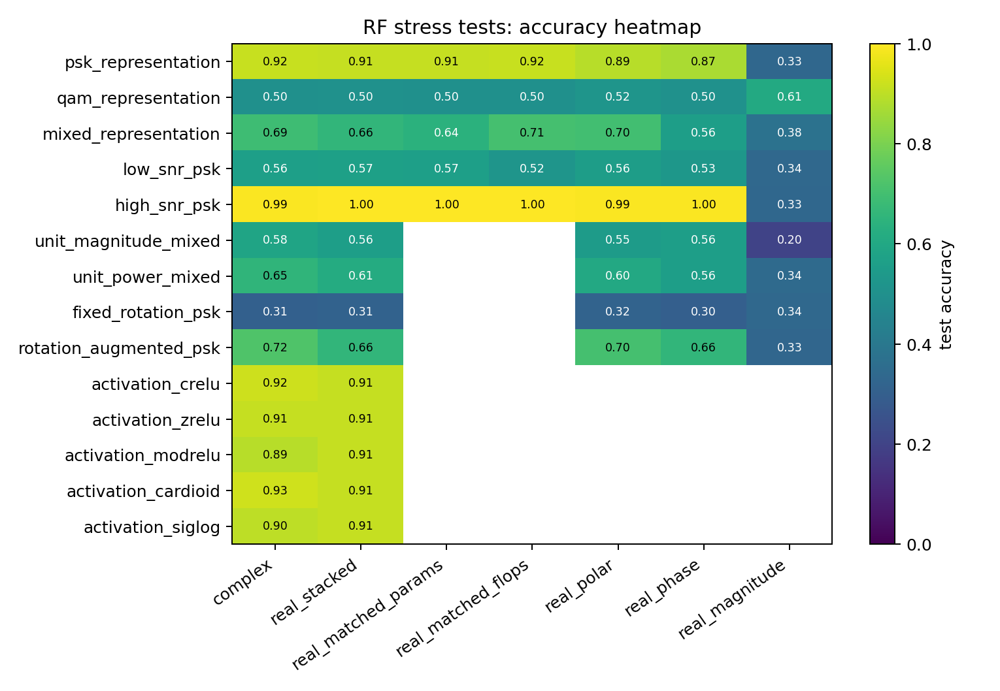
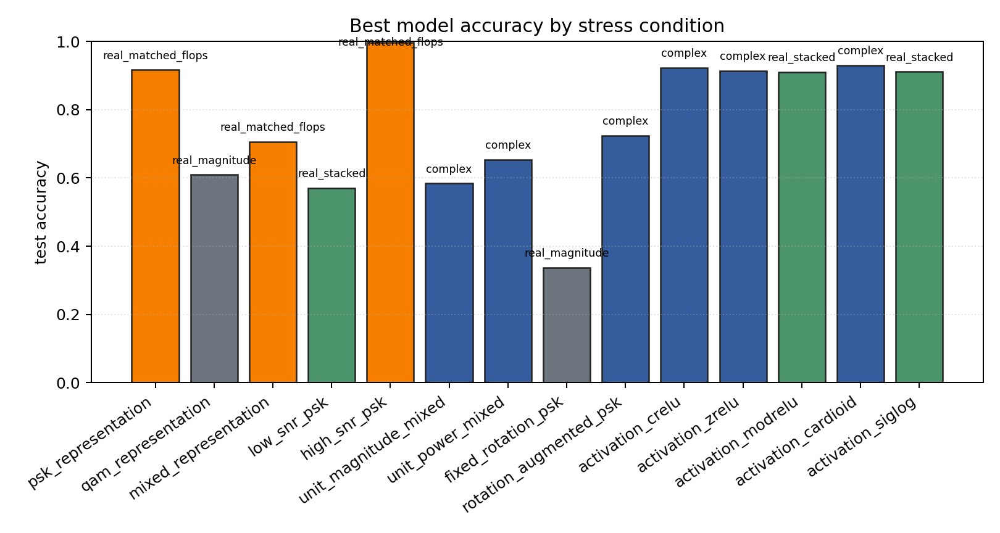

# RF Synthetic Representation Stress Tests

Sequential contradiction tests for whether complex-valued RF models help because of native complex arithmetic, coordinate choice, phase information, augmentation, or compute budget.

## Plots

| condition | best | acc | complex | real_stack | phase | polar | magnitude |
| --- | --- | ---: | ---: | ---: | ---: | ---: | ---: |
| `psk_representation` | `real_matched_flops` | 0.9165 | 0.9152 | 0.9115 | 0.8723 | 0.8939 | 0.3344 |
| `qam_representation` | `real_magnitude` | 0.6091 | 0.5036 | 0.5045 | 0.5045 | 0.5207 | 0.6091 |
| `mixed_representation` | `real_matched_flops` | 0.7063 | 0.6900 | 0.6590 | 0.5621 | 0.6963 | 0.3777 |
| `low_snr_psk` | `real_stacked` | 0.5700 | 0.5640 | 0.5700 | 0.5279 | 0.5575 | 0.3379 |
| `high_snr_psk` | `real_matched_flops` | 0.9974 | 0.9929 | 0.9972 | 0.9955 | 0.9927 | 0.3333 |
| `unit_magnitude_mixed` | `complex` | 0.5838 | 0.5838 | 0.5606 | 0.5610 | 0.5498 | 0.2000 |
| `unit_power_mixed` | `complex` | 0.6531 | 0.6531 | 0.6141 | 0.5605 | 0.6027 | 0.3446 |
| `fixed_rotation_psk` | `real_magnitude` | 0.3368 | 0.3085 | 0.3150 | 0.3020 | 0.3195 | 0.3368 |
| `rotation_augmented_psk` | `complex` | 0.7245 | 0.7245 | 0.6580 | 0.6565 | 0.7040 | 0.3303 |
| `activation_crelu` | `complex` | 0.9228 | 0.9228 | 0.9120 | - | - | - |
| `activation_zrelu` | `complex` | 0.9137 | 0.9137 | 0.9113 | - | - | - |
| `activation_modrelu` | `real_stacked` | 0.9102 | 0.8915 | 0.9102 | - | - | - |
| `activation_cardioid` | `complex` | 0.9294 | 0.9294 | 0.9111 | - | - | - |
| `activation_siglog` | `real_stacked` | 0.9111 | 0.9012 | 0.9111 | - | - | - |

Each condition directory contains `raw_runs.json`, `summary.json`, `summary.md`, and `manifest.json`.
