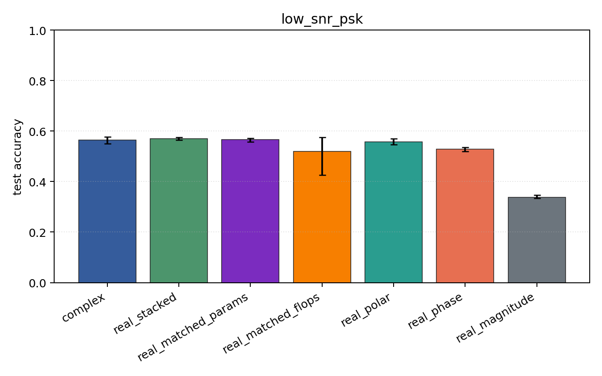
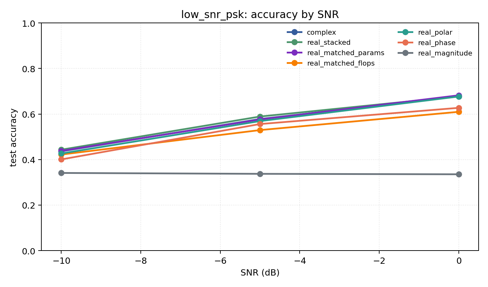

# low_snr_psk

Question: Does phase become too noisy in the low-SNR regime?

Contradiction signal: Cartesian or magnitude-heavy encodings beat phase/polar at low SNR, suggesting phase singularity/noise sensitivity.

Modulations: `['bpsk', 'qpsk', '8psk']`. SNR (dB): `[-10, -5, 0]`. Architecture: `conv`. Activation: `zrelu`. Train transform: `none`. Test transform: `none`.

## Plots

| model | hidden | params | MAdds | accuracy | std | 95% CI | loss | s/run |
| --- | ---: | ---: | ---: | ---: | ---: | --- | ---: | ---: |
| `complex` | 32 | 10886 | 2703744 | 0.5640 | 0.0188 | [0.5502, 0.5774] | 0.804 | 2.4 |
| `real_stacked` | 32 | 5603 | 696416 | 0.5700 | 0.0063 | [0.5653, 0.5750] | 0.787 | 0.57 |
| `real_matched_params` | 45 | 10803 | 1353735 | 0.5655 | 0.0099 | [0.5571, 0.5720] | 0.783 | 0.89 |
| `real_matched_flops` | 64 | 21443 | 2703552 | 0.5204 | 0.1052 | [0.4250, 0.5745] | 0.84 | 1 |
| `real_polar` | 32 | 5763 | 716896 | 0.5575 | 0.0135 | [0.5469, 0.5694] | 0.785 | 0.56 |
| `real_phase` | 32 | 5603 | 696416 | 0.5279 | 0.0098 | [0.5200, 0.5355] | 0.846 | 0.56 |
| `real_magnitude` | 32 | 5443 | 675936 | 0.3379 | 0.0101 | [0.3333, 0.3469] | 1.1 | 0.56 |

## Accuracy by SNR (dB)

| model | -10 dB | -5 dB | 0 dB |
| --- | ---: | ---: | ---: |
| `complex` | 0.436 | 0.578 | 0.678 |
| `real_stacked` | 0.443 | 0.589 | 0.678 |
| `real_matched_params` | 0.438 | 0.576 | 0.682 |
| `real_matched_flops` | 0.422 | 0.529 | 0.610 |
| `real_polar` | 0.427 | 0.569 | 0.677 |
| `real_phase` | 0.401 | 0.556 | 0.627 |
| `real_magnitude` | 0.341 | 0.337 | 0.335 |
