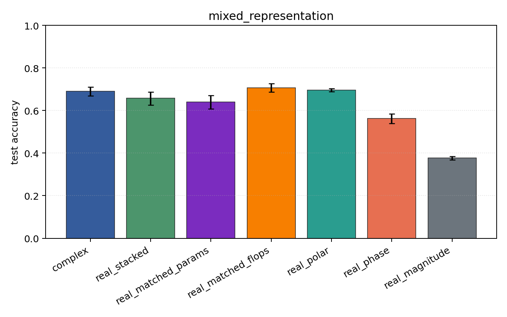
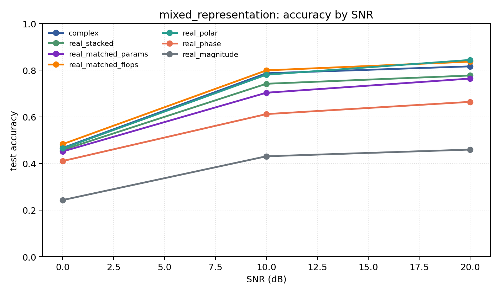

# mixed_representation

Question: Does the representation conclusion survive PSK+QAM together?

Contradiction signal: a hand-chosen real coordinate system matches or beats the complex model over mixed modulation families.

Modulations: `['bpsk', 'qpsk', '8psk', 'qam16', 'qam64']`. SNR (dB): `[0, 10, 20]`. Architecture: `conv`. Activation: `zrelu`. Train transform: `none`. Test transform: `none`.

## Plots

| model | hidden | params | MAdds | accuracy | std | 95% CI | loss | s/run |
| --- | ---: | ---: | ---: | ---: | ---: | --- | ---: | ---: |
| `complex` | 32 | 11018 | 2704000 | 0.6900 | 0.0278 | [0.6689, 0.7111] | 0.699 | 2.4 |
| `real_stacked` | 32 | 5669 | 696480 | 0.6590 | 0.0425 | [0.6254, 0.6865] | 0.77 | 0.57 |
| `real_matched_params` | 45 | 10895 | 1353825 | 0.6396 | 0.0409 | [0.6076, 0.6716] | 0.814 | 0.86 |
| `real_matched_flops` | 64 | 21573 | 2703680 | 0.7063 | 0.0252 | [0.6867, 0.7258] | 0.654 | 1 |
| `real_polar` | 32 | 5829 | 716960 | 0.6963 | 0.0099 | [0.6887, 0.7039] | 0.646 | 0.58 |
| `real_phase` | 32 | 5669 | 696480 | 0.5621 | 0.0292 | [0.5397, 0.5839] | 0.944 | 0.57 |
| `real_magnitude` | 32 | 5509 | 676000 | 0.3777 | 0.0107 | [0.3682, 0.3852] | 1.18 | 0.56 |

## Accuracy by SNR (dB)

| model | 0 dB | 10 dB | 20 dB |
| --- | ---: | ---: | ---: |
| `complex` | 0.467 | 0.787 | 0.816 |
| `real_stacked` | 0.458 | 0.742 | 0.777 |
| `real_matched_params` | 0.452 | 0.703 | 0.764 |
| `real_matched_flops` | 0.483 | 0.799 | 0.837 |
| `real_polar` | 0.464 | 0.781 | 0.844 |
| `real_phase` | 0.410 | 0.612 | 0.664 |
| `real_magnitude` | 0.243 | 0.431 | 0.459 |
