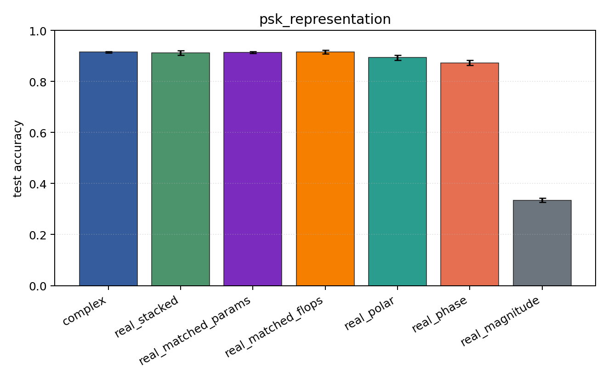
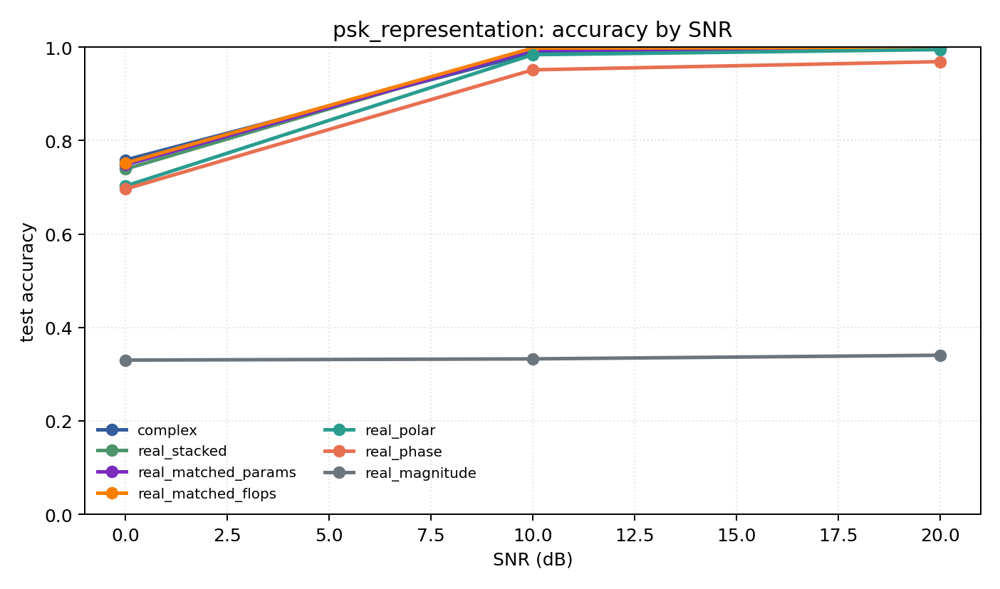

# psk_representation

Question: Do phase-aware encodings explain PSK-family performance?

Contradiction signal: magnitude-only approaches phase/Cartesian accuracy, or real encodings consistently beat complex.

Modulations: `['bpsk', 'qpsk', '8psk']`. SNR (dB): `[0, 10, 20]`. Architecture: `conv`. Activation: `zrelu`. Train transform: `none`. Test transform: `none`.

## Plots

| model | hidden | params | MAdds | accuracy | std | 95% CI | loss | s/run |
| --- | ---: | ---: | ---: | ---: | ---: | --- | ---: | ---: |
| `complex` | 32 | 10886 | 2703744 | 0.9152 | 0.0032 | [0.9128, 0.9178] | 0.203 | 2.4 |
| `real_stacked` | 32 | 5603 | 696416 | 0.9115 | 0.0109 | [0.9036, 0.9208] | 0.198 | 0.56 |
| `real_matched_params` | 45 | 10803 | 1353735 | 0.9133 | 0.0049 | [0.9098, 0.9167] | 0.2 | 0.89 |
| `real_matched_flops` | 64 | 21443 | 2703552 | 0.9165 | 0.0092 | [0.9094, 0.9232] | 0.177 | 1 |
| `real_polar` | 32 | 5763 | 716896 | 0.8939 | 0.0132 | [0.8837, 0.9040] | 0.229 | 0.56 |
| `real_phase` | 32 | 5603 | 696416 | 0.8723 | 0.0131 | [0.8639, 0.8835] | 0.275 | 0.57 |
| `real_magnitude` | 32 | 5443 | 675936 | 0.3344 | 0.0104 | [0.3262, 0.3437] | 1.1 | 0.56 |

## Accuracy by SNR (dB)

| model | 0 dB | 10 dB | 20 dB |
| --- | ---: | ---: | ---: |
| `complex` | 0.759 | 0.988 | 0.999 |
| `real_stacked` | 0.739 | 0.997 | 0.999 |
| `real_matched_params` | 0.748 | 0.994 | 0.998 |
| `real_matched_flops` | 0.752 | 0.998 | 0.999 |
| `real_polar` | 0.703 | 0.984 | 0.995 |
| `real_phase` | 0.696 | 0.951 | 0.969 |
| `real_magnitude` | 0.330 | 0.333 | 0.340 |
