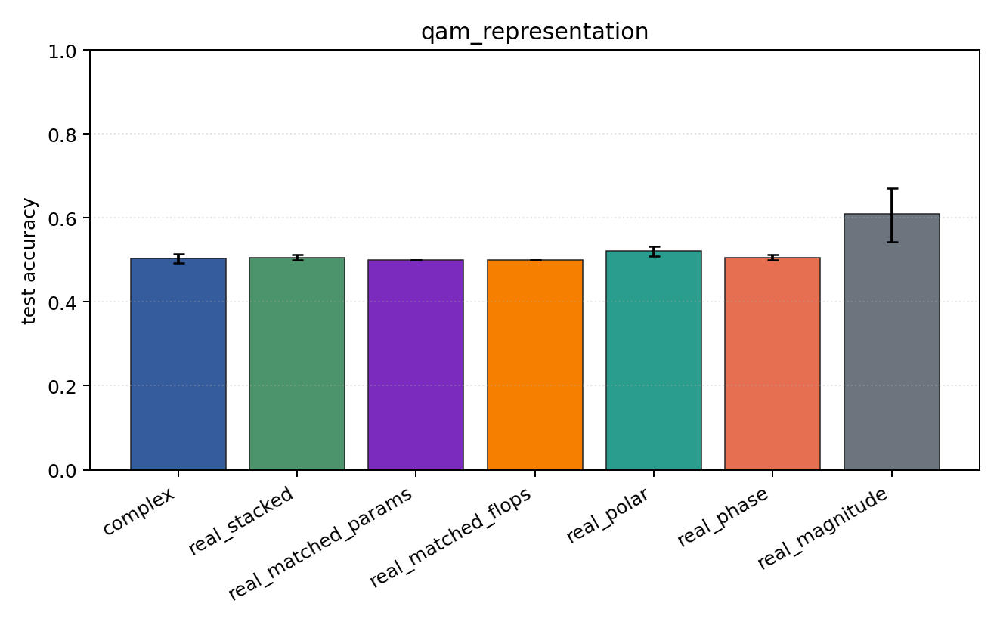
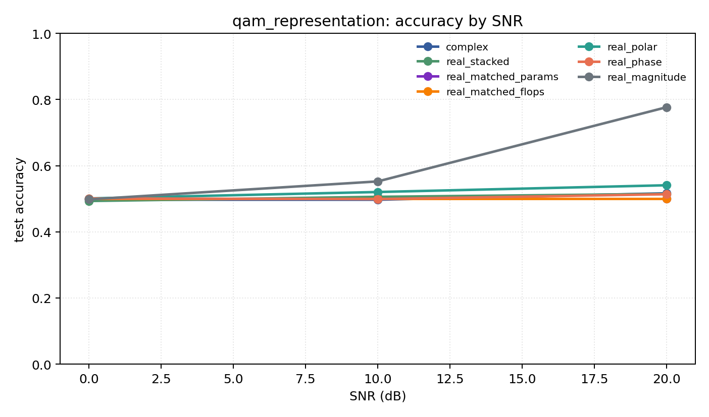

# qam_representation

Question: Does amplitude structure change the story on QAM-only data?

Contradiction signal: magnitude-only becomes competitive, or phase-only collapses relative to Cartesian/polar.

Modulations: `['qam16', 'qam64']`. SNR (dB): `[0, 10, 20]`. Architecture: `conv`. Activation: `zrelu`. Train transform: `none`. Test transform: `none`.

## Plots

| model | hidden | params | MAdds | accuracy | std | 95% CI | loss | s/run |
| --- | ---: | ---: | ---: | ---: | ---: | --- | ---: | ---: |
| `complex` | 32 | 10820 | 2703616 | 0.5036 | 0.0132 | [0.4932, 0.5136] | 0.802 | 2.4 |
| `real_stacked` | 32 | 5570 | 696384 | 0.5045 | 0.0087 | [0.4994, 0.5126] | 0.694 | 0.59 |
| `real_matched_params` | 45 | 10757 | 1353690 | 0.5000 | 0.0000 | [0.5000, 0.5000] | 0.693 | 0.88 |
| `real_matched_flops` | 64 | 21378 | 2703488 | 0.5000 | 0.0000 | [0.5000, 0.5000] | 0.693 | 1 |
| `real_polar` | 32 | 5730 | 716864 | 0.5207 | 0.0151 | [0.5094, 0.5324] | 0.701 | 0.54 |
| `real_phase` | 32 | 5570 | 696384 | 0.5045 | 0.0084 | [0.5000, 0.5123] | 0.694 | 0.56 |
| `real_magnitude` | 32 | 5410 | 675904 | 0.6091 | 0.0816 | [0.5424, 0.6709] | 0.619 | 0.58 |

## Accuracy by SNR (dB)

| model | 0 dB | 10 dB | 20 dB |
| --- | ---: | ---: | ---: |
| `complex` | 0.497 | 0.497 | 0.517 |
| `real_stacked` | 0.493 | 0.506 | 0.515 |
| `real_matched_params` | 0.500 | 0.500 | 0.500 |
| `real_matched_flops` | 0.500 | 0.500 | 0.500 |
| `real_polar` | 0.501 | 0.520 | 0.541 |
| `real_phase` | 0.501 | 0.499 | 0.514 |
| `real_magnitude` | 0.498 | 0.552 | 0.777 |
