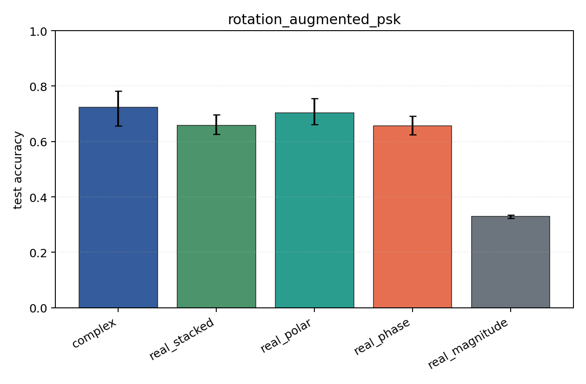
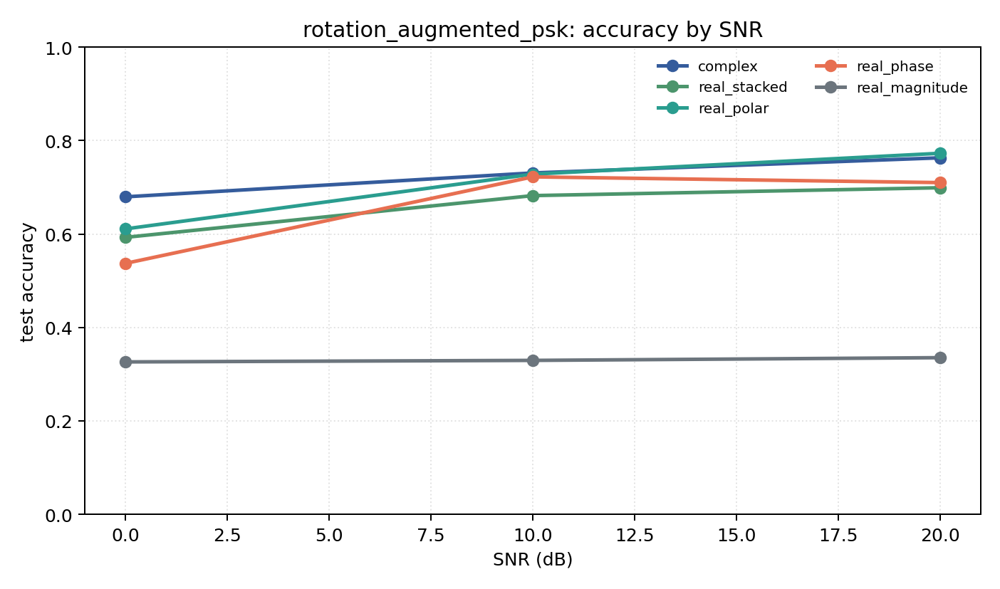

# rotation_augmented_psk

Question: Can real baselines recover rotation robustness with augmentation?

Contradiction signal: random train rotations close the gap to complex under fixed rotated test data, making augmentation the key ingredient.

Modulations: `['bpsk', 'qpsk', '8psk']`. SNR (dB): `[0, 10, 20]`. Architecture: `conv`. Activation: `zrelu`. Train transform: `random_rotation`. Test transform: `fixed_rotation`.

## Plots

| model | hidden | params | MAdds | accuracy | std | 95% CI | loss | s/run |
| --- | ---: | ---: | ---: | ---: | ---: | --- | ---: | ---: |
| `complex` | 32 | 10886 | 2703744 | 0.7245 | 0.0823 | [0.6561, 0.7821] | 0.449 | 5.1 |
| `real_stacked` | 32 | 5603 | 696416 | 0.6580 | 0.0472 | [0.6261, 0.6962] | 0.537 | 2.3 |
| `real_polar` | 32 | 5763 | 716896 | 0.7040 | 0.0574 | [0.6617, 0.7553] | 0.528 | 2.3 |
| `real_phase` | 32 | 5603 | 696416 | 0.6565 | 0.0447 | [0.6239, 0.6915] | 0.591 | 2.3 |
| `real_magnitude` | 32 | 5443 | 675936 | 0.3303 | 0.0080 | [0.3230, 0.3346] | 1.1 | 2.3 |

## Accuracy by SNR (dB)

| model | 0 dB | 10 dB | 20 dB |
| --- | ---: | ---: | ---: |
| `complex` | 0.680 | 0.731 | 0.763 |
| `real_stacked` | 0.593 | 0.682 | 0.699 |
| `real_polar` | 0.611 | 0.728 | 0.773 |
| `real_phase` | 0.537 | 0.722 | 0.710 |
| `real_magnitude` | 0.326 | 0.329 | 0.335 |
