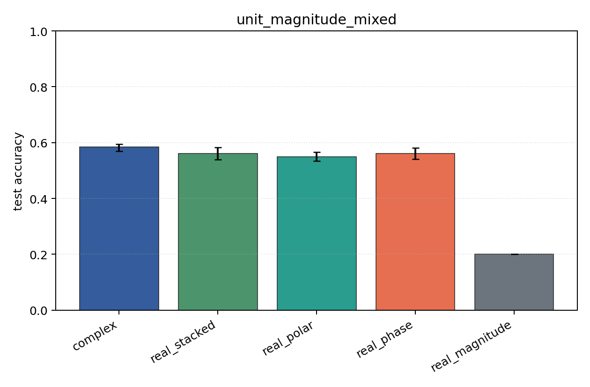
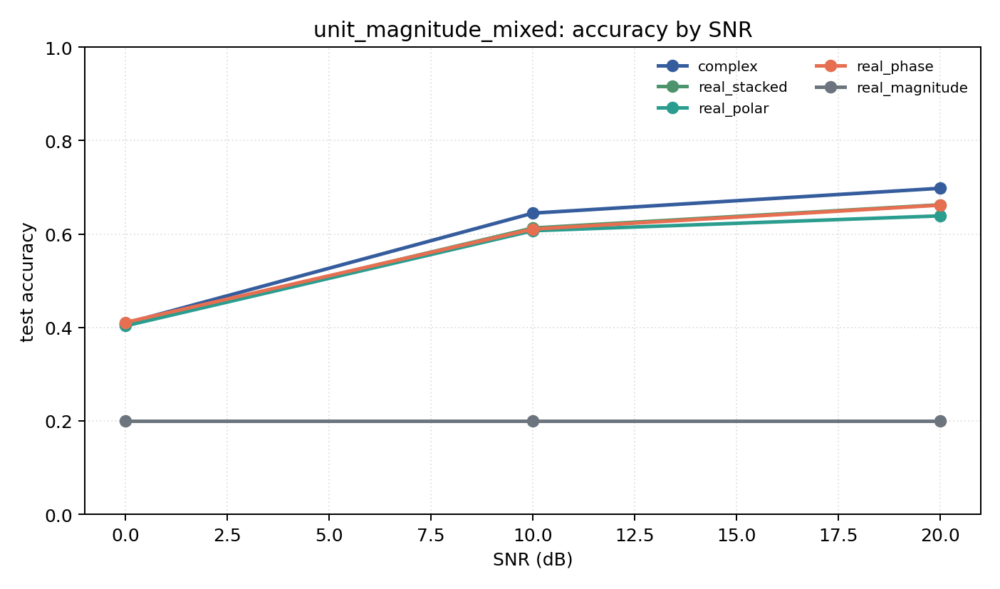

# unit_magnitude_mixed

Question: What happens if per-symbol amplitude is removed?

Contradiction signal: complex or phase-only still performs on QAM after amplitude is removed, implying hidden leakage or a too-easy task.

Modulations: `['bpsk', 'qpsk', '8psk', 'qam16', 'qam64']`. SNR (dB): `[0, 10, 20]`. Architecture: `conv`. Activation: `zrelu`. Train transform: `unit_magnitude`. Test transform: `unit_magnitude`.

## Plots

| model | hidden | params | MAdds | accuracy | std | 95% CI | loss | s/run |
| --- | ---: | ---: | ---: | ---: | ---: | --- | ---: | ---: |
| `complex` | 32 | 11018 | 2704000 | 0.5838 | 0.0167 | [0.5694, 0.5951] | 0.912 | 4.9 |
| `real_stacked` | 32 | 5669 | 696480 | 0.5606 | 0.0289 | [0.5388, 0.5825] | 0.942 | 2.1 |
| `real_polar` | 32 | 5829 | 716960 | 0.5498 | 0.0210 | [0.5344, 0.5660] | 0.947 | 2.1 |
| `real_phase` | 32 | 5669 | 696480 | 0.5610 | 0.0267 | [0.5403, 0.5815] | 0.944 | 2.1 |
| `real_magnitude` | 32 | 5509 | 676000 | 0.2000 | 0.0000 | [0.2000, 0.2000] | 1.61 | 2.4 |

## Accuracy by SNR (dB)

| model | 0 dB | 10 dB | 20 dB |
| --- | ---: | ---: | ---: |
| `complex` | 0.409 | 0.645 | 0.698 |
| `real_stacked` | 0.407 | 0.613 | 0.663 |
| `real_polar` | 0.403 | 0.607 | 0.639 |
| `real_phase` | 0.411 | 0.610 | 0.662 |
| `real_magnitude` | 0.200 | 0.200 | 0.200 |
