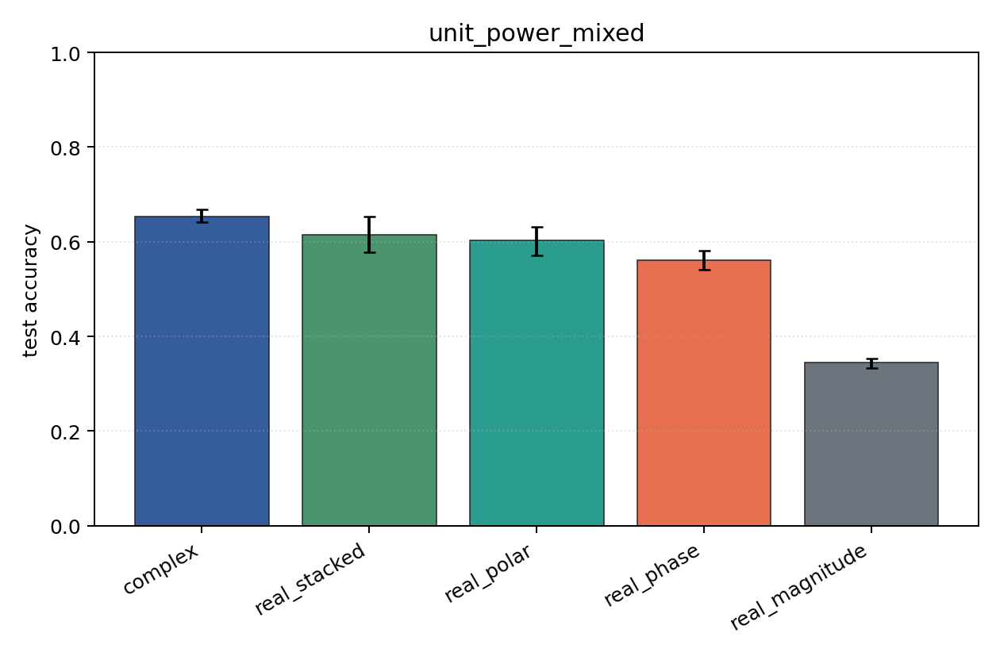
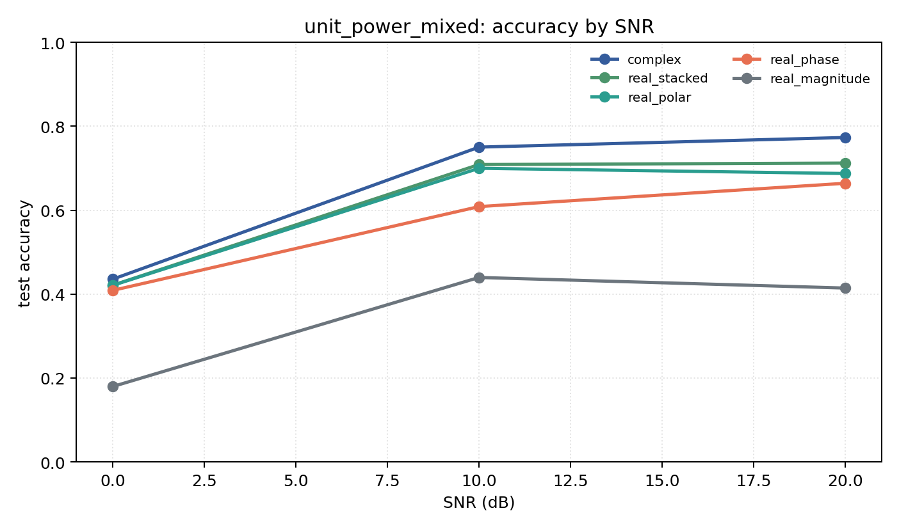

# unit_power_mixed

Question: Does per-example energy normalization change the ranking?

Contradiction signal: rankings change substantially, suggesting models were using energy/SNR scale rather than modulation geometry.

Modulations: `['bpsk', 'qpsk', '8psk', 'qam16', 'qam64']`. SNR (dB): `[0, 10, 20]`. Architecture: `conv`. Activation: `zrelu`. Train transform: `unit_power`. Test transform: `unit_power`.

## Plots

| model | hidden | params | MAdds | accuracy | std | 95% CI | loss | s/run |
| --- | ---: | ---: | ---: | ---: | ---: | --- | ---: | ---: |
| `complex` | 32 | 11018 | 2704000 | 0.6531 | 0.0175 | [0.6413, 0.6687] | 0.765 | 5.7 |
| `real_stacked` | 32 | 5669 | 696480 | 0.6141 | 0.0471 | [0.5785, 0.6539] | 0.847 | 2.1 |
| `real_polar` | 32 | 5829 | 716960 | 0.6027 | 0.0407 | [0.5718, 0.6318] | 0.859 | 2.2 |
| `real_phase` | 32 | 5669 | 696480 | 0.5605 | 0.0260 | [0.5402, 0.5808] | 0.945 | 2.4 |
| `real_magnitude` | 32 | 5509 | 676000 | 0.3446 | 0.0130 | [0.3335, 0.3531] | 1.29 | 2.5 |

## Accuracy by SNR (dB)

| model | 0 dB | 10 dB | 20 dB |
| --- | ---: | ---: | ---: |
| `complex` | 0.436 | 0.750 | 0.773 |
| `real_stacked` | 0.421 | 0.709 | 0.712 |
| `real_polar` | 0.421 | 0.700 | 0.687 |
| `real_phase` | 0.409 | 0.609 | 0.664 |
| `real_magnitude` | 0.180 | 0.440 | 0.414 |
