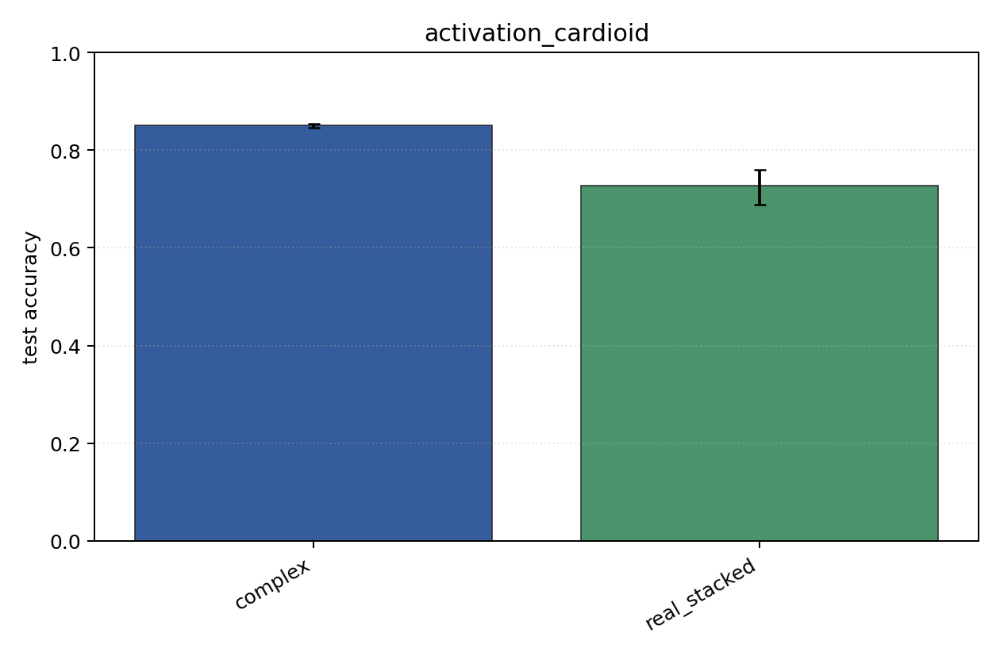
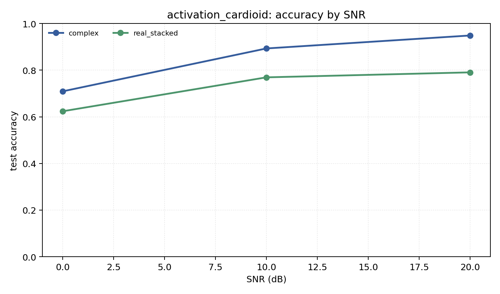

# activation_cardioid

Question: How much does complex activation `cardioid` matter?

Contradiction signal: the complex result changes enough across activations that the broad 'complex NN' claim is underspecified.

Modulations: `['bpsk', 'qpsk', '8psk']`. SNR (dB): `[0, 10, 20]`. Architecture: `conv`. Activation: `cardioid`. Train transform: `none`. Test transform: `none`.

## Plots

| model | hidden | params | MAdds | accuracy | std | 95% CI | loss | s/run |
| --- | ---: | ---: | ---: | ---: | ---: | --- | ---: | ---: |
| `complex` | 16 | 2886 | 348352 | 0.8504 | 0.0043 | [0.8462, 0.8547] | 0.339 | 0.93 |
| `real_stacked` | 16 | 1523 | 92208 | 0.7279 | 0.0368 | [0.6880, 0.7607] | 0.436 | 0.31 |

## Accuracy by SNR (dB)

| model | 0 dB | 10 dB | 20 dB |
| --- | ---: | ---: | ---: |
| `complex` | 0.709 | 0.893 | 0.949 |
| `real_stacked` | 0.624 | 0.769 | 0.791 |
