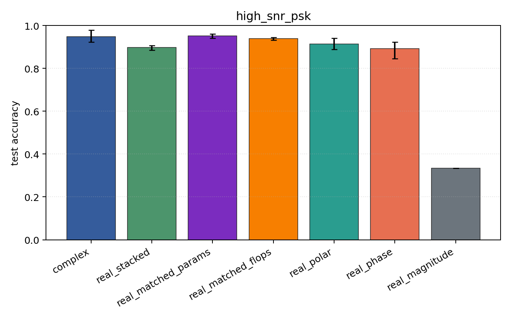
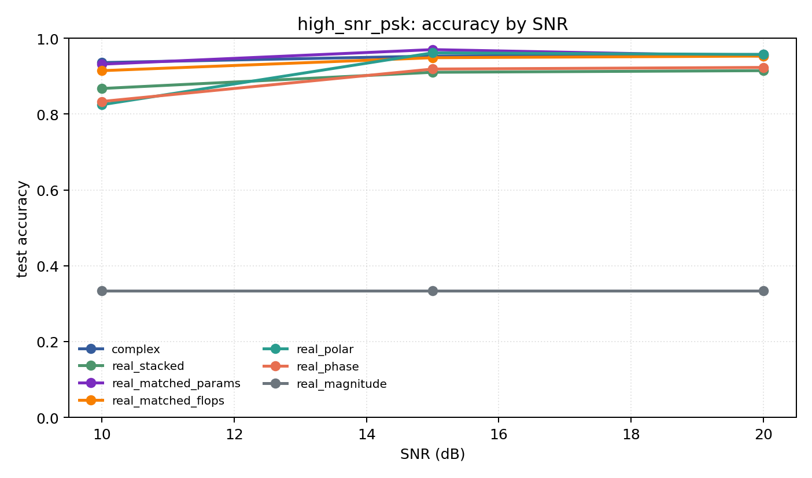

# high_snr_psk

Question: Is the complex advantage only a high-SNR effect?

Contradiction signal: complex only separates from real baselines when the phase estimate is clean.

Modulations: `['bpsk', 'qpsk', '8psk']`. SNR (dB): `[10, 15, 20]`. Architecture: `conv`. Activation: `zrelu`. Train transform: `none`. Test transform: `none`.

## Plots

| model | hidden | params | MAdds | accuracy | std | 95% CI | loss | s/run |
| --- | ---: | ---: | ---: | ---: | ---: | --- | ---: | ---: |
| `complex` | 16 | 2886 | 348352 | 0.9487 | 0.0280 | [0.9231, 0.9786] | 0.12 | 0.79 |
| `real_stacked` | 16 | 1523 | 92208 | 0.8974 | 0.0113 | [0.8846, 0.9060] | 0.218 | 0.31 |
| `real_matched_params` | 23 | 2993 | 184069 | 0.9516 | 0.0108 | [0.9402, 0.9615] | 0.132 | 0.32 |
| `real_matched_flops` | 32 | 5603 | 348256 | 0.9387 | 0.0065 | [0.9316, 0.9444] | 0.141 | 0.31 |
| `real_polar` | 16 | 1603 | 97328 | 0.9145 | 0.0256 | [0.8889, 0.9402] | 0.232 | 0.31 |
| `real_phase` | 16 | 1523 | 92208 | 0.8917 | 0.0404 | [0.8462, 0.9231] | 0.226 | 0.31 |
| `real_magnitude` | 16 | 1443 | 87088 | 0.3333 | 0.0000 | [0.3333, 0.3333] | 1.1 | 0.31 |

## Accuracy by SNR (dB)

| model | 10 dB | 15 dB | 20 dB |
| --- | ---: | ---: | ---: |
| `complex` | 0.936 | 0.953 | 0.957 |
| `real_stacked` | 0.868 | 0.910 | 0.915 |
| `real_matched_params` | 0.932 | 0.970 | 0.953 |
| `real_matched_flops` | 0.915 | 0.949 | 0.953 |
| `real_polar` | 0.825 | 0.962 | 0.957 |
| `real_phase` | 0.833 | 0.919 | 0.923 |
| `real_magnitude` | 0.333 | 0.333 | 0.333 |
