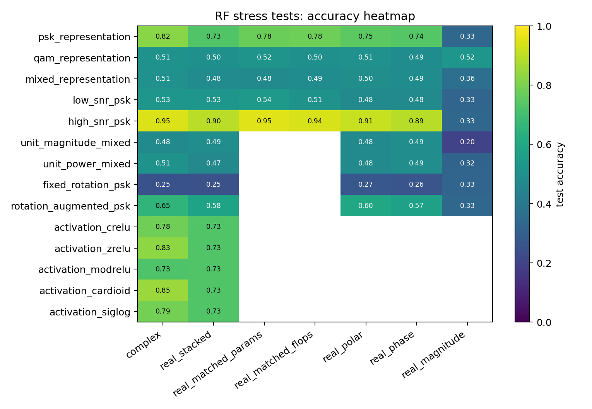
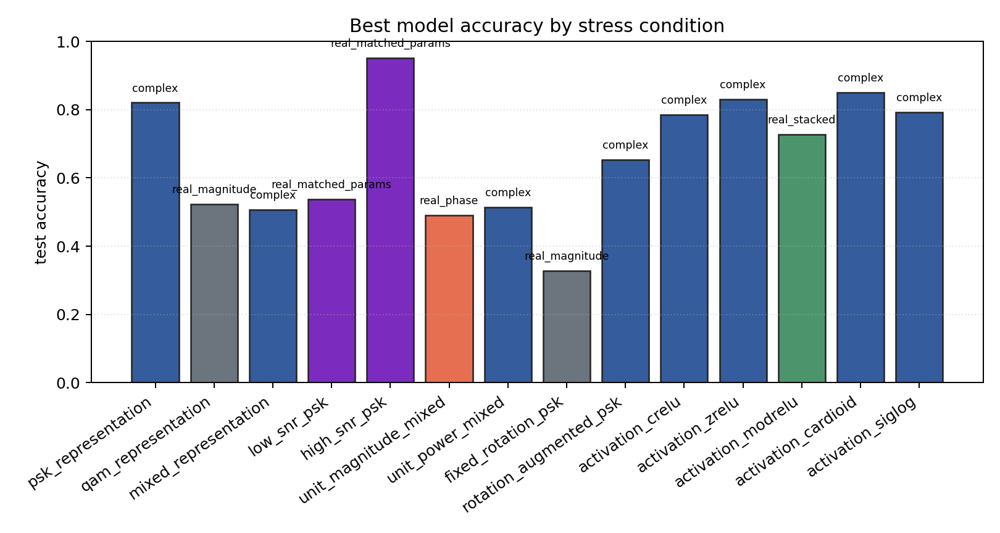

# RF Synthetic Representation Stress Tests

Sequential contradiction tests for whether complex-valued RF models help because of native complex arithmetic, coordinate choice, phase information, augmentation, or compute budget.

## Plots

| condition | best | acc | complex | real_stack | phase | polar | magnitude |
| --- | --- | ---: | ---: | ---: | ---: | ---: | ---: |
| `psk_representation` | `complex` | 0.8205 | 0.8205 | 0.7279 | 0.7350 | 0.7479 | 0.3333 |
| `qam_representation` | `real_magnitude` | 0.5235 | 0.5085 | 0.5021 | 0.4872 | 0.5064 | 0.5235 |
| `mixed_representation` | `complex` | 0.5068 | 0.5068 | 0.4812 | 0.4872 | 0.4957 | 0.3650 |
| `low_snr_psk` | `real_matched_params` | 0.5370 | 0.5256 | 0.5256 | 0.4786 | 0.4786 | 0.3262 |
| `high_snr_psk` | `real_matched_params` | 0.9516 | 0.9487 | 0.8974 | 0.8917 | 0.9145 | 0.3333 |
| `unit_magnitude_mixed` | `real_phase` | 0.4906 | 0.4761 | 0.4897 | 0.4906 | 0.4803 | 0.2000 |
| `unit_power_mixed` | `complex` | 0.5137 | 0.5137 | 0.4726 | 0.4897 | 0.4803 | 0.3205 |
| `fixed_rotation_psk` | `real_magnitude` | 0.3276 | 0.2521 | 0.2464 | 0.2621 | 0.2721 | 0.3276 |
| `rotation_augmented_psk` | `complex` | 0.6538 | 0.6538 | 0.5798 | 0.5741 | 0.5983 | 0.3333 |
| `activation_crelu` | `complex` | 0.7849 | 0.7849 | 0.7279 | - | - | - |
| `activation_zrelu` | `complex` | 0.8305 | 0.8305 | 0.7279 | - | - | - |
| `activation_modrelu` | `real_stacked` | 0.7279 | 0.7265 | 0.7279 | - | - | - |
| `activation_cardioid` | `complex` | 0.8504 | 0.8504 | 0.7279 | - | - | - |
| `activation_siglog` | `complex` | 0.7920 | 0.7920 | 0.7279 | - | - | - |

Each condition directory contains `raw_runs.json`, `summary.json`, `summary.md`, and `manifest.json`.
