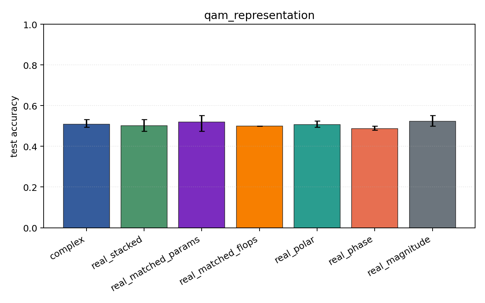
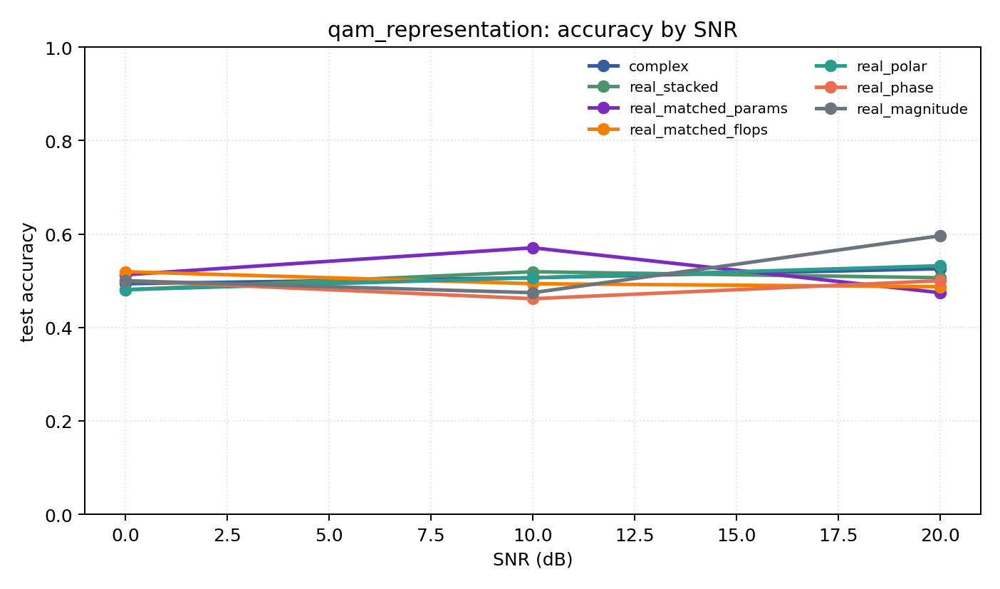

# qam_representation

Question: Does amplitude structure change the story on QAM-only data?

Contradiction signal: magnitude-only becomes competitive, or phase-only collapses relative to Cartesian/polar.

Modulations: `['qam16', 'qam64']`. SNR (dB): `[0, 10, 20]`. Architecture: `conv`. Activation: `zrelu`. Train transform: `none`. Test transform: `none`.

## Plots

| model | hidden | params | MAdds | accuracy | std | 95% CI | loss | s/run |
| --- | ---: | ---: | ---: | ---: | ---: | --- | ---: | ---: |
| `complex` | 16 | 2852 | 348288 | 0.5085 | 0.0206 | [0.4936, 0.5321] | 0.744 | 0.79 |
| `real_stacked` | 16 | 1506 | 92192 | 0.5021 | 0.0289 | [0.4744, 0.5321] | 0.694 | 0.31 |
| `real_matched_params` | 23 | 2969 | 184046 | 0.5192 | 0.0400 | [0.4744, 0.5513] | 0.694 | 0.32 |
| `real_matched_flops` | 32 | 5570 | 348224 | 0.5000 | 0.0000 | [0.5000, 0.5000] | 0.696 | 0.32 |
| `real_polar` | 16 | 1586 | 97312 | 0.5064 | 0.0170 | [0.4936, 0.5256] | 0.699 | 0.31 |
| `real_phase` | 16 | 1506 | 92192 | 0.4872 | 0.0111 | [0.4808, 0.5000] | 0.697 | 0.31 |
| `real_magnitude` | 16 | 1426 | 87072 | 0.5235 | 0.0259 | [0.5000, 0.5513] | 0.691 | 0.31 |

## Accuracy by SNR (dB)

| model | 0 dB | 10 dB | 20 dB |
| --- | ---: | ---: | ---: |
| `complex` | 0.494 | 0.506 | 0.526 |
| `real_stacked` | 0.481 | 0.519 | 0.506 |
| `real_matched_params` | 0.513 | 0.571 | 0.474 |
| `real_matched_flops` | 0.519 | 0.494 | 0.487 |
| `real_polar` | 0.481 | 0.506 | 0.532 |
| `real_phase` | 0.500 | 0.462 | 0.500 |
| `real_magnitude` | 0.500 | 0.474 | 0.596 |
