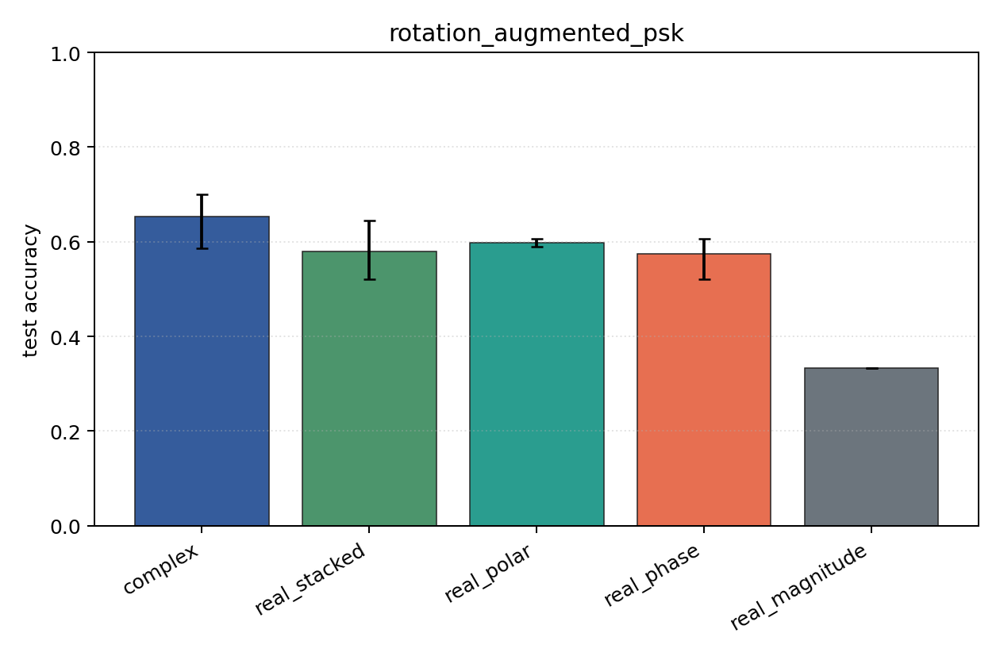
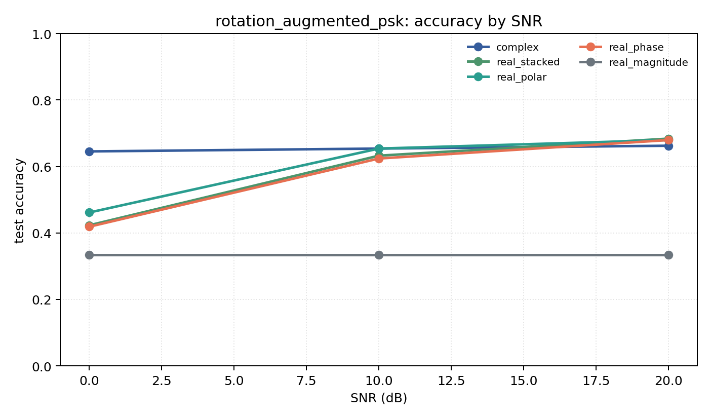

# rotation_augmented_psk

Question: Can real baselines recover rotation robustness with augmentation?

Contradiction signal: random train rotations close the gap to complex under fixed rotated test data, making augmentation the key ingredient.

Modulations: `['bpsk', 'qpsk', '8psk']`. SNR (dB): `[0, 10, 20]`. Architecture: `conv`. Activation: `zrelu`. Train transform: `random_rotation`. Test transform: `fixed_rotation`.

## Plots

| model | hidden | params | MAdds | accuracy | std | 95% CI | loss | s/run |
| --- | ---: | ---: | ---: | ---: | ---: | --- | ---: | ---: |
| `complex` | 16 | 2886 | 348352 | 0.6538 | 0.0606 | [0.5855, 0.7009] | 0.529 | 0.79 |
| `real_stacked` | 16 | 1523 | 92208 | 0.5798 | 0.0623 | [0.5214, 0.6453] | 0.761 | 0.34 |
| `real_polar` | 16 | 1603 | 97328 | 0.5983 | 0.0085 | [0.5897, 0.6068] | 0.731 | 0.33 |
| `real_phase` | 16 | 1523 | 92208 | 0.5741 | 0.0461 | [0.5214, 0.6068] | 0.758 | 0.33 |
| `real_magnitude` | 16 | 1443 | 87088 | 0.3333 | 0.0000 | [0.3333, 0.3333] | 1.1 | 0.33 |

## Accuracy by SNR (dB)

| model | 0 dB | 10 dB | 20 dB |
| --- | ---: | ---: | ---: |
| `complex` | 0.645 | 0.654 | 0.662 |
| `real_stacked` | 0.423 | 0.632 | 0.684 |
| `real_polar` | 0.462 | 0.654 | 0.679 |
| `real_phase` | 0.419 | 0.624 | 0.679 |
| `real_magnitude` | 0.333 | 0.333 | 0.333 |
