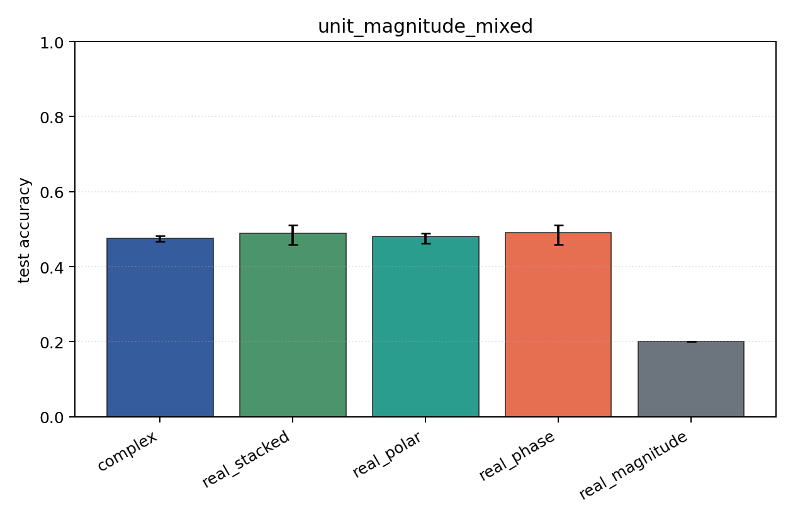
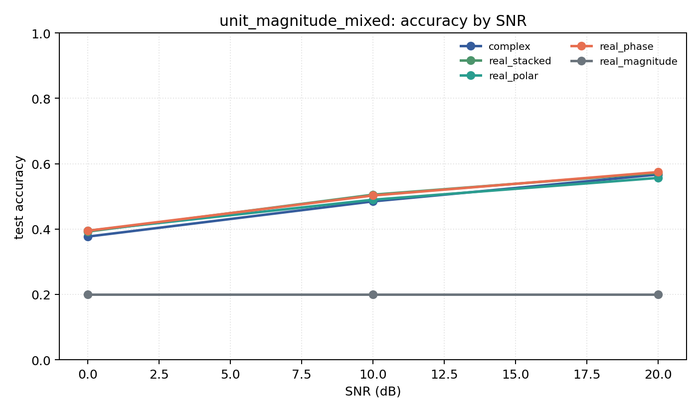

# unit_magnitude_mixed

Question: What happens if per-symbol amplitude is removed?

Contradiction signal: complex or phase-only still performs on QAM after amplitude is removed, implying hidden leakage or a too-easy task.

Modulations: `['bpsk', 'qpsk', '8psk', 'qam16', 'qam64']`. SNR (dB): `[0, 10, 20]`. Architecture: `conv`. Activation: `zrelu`. Train transform: `unit_magnitude`. Test transform: `unit_magnitude`.

## Plots

| model | hidden | params | MAdds | accuracy | std | 95% CI | loss | s/run |
| --- | ---: | ---: | ---: | ---: | ---: | --- | ---: | ---: |
| `complex` | 16 | 2954 | 348480 | 0.4761 | 0.0082 | [0.4667, 0.4821] | 1.1 | 0.77 |
| `real_stacked` | 16 | 1557 | 92240 | 0.4897 | 0.0271 | [0.4590, 0.5103] | 1.11 | 0.31 |
| `real_polar` | 16 | 1637 | 97360 | 0.4803 | 0.0163 | [0.4615, 0.4897] | 1.11 | 0.32 |
| `real_phase` | 16 | 1557 | 92240 | 0.4906 | 0.0277 | [0.4590, 0.5103] | 1.11 | 0.32 |
| `real_magnitude` | 16 | 1477 | 87120 | 0.2000 | 0.0000 | [0.2000, 0.2000] | 1.61 | 0.32 |

## Accuracy by SNR (dB)

| model | 0 dB | 10 dB | 20 dB |
| --- | ---: | ---: | ---: |
| `complex` | 0.377 | 0.485 | 0.567 |
| `real_stacked` | 0.392 | 0.505 | 0.572 |
| `real_polar` | 0.395 | 0.490 | 0.556 |
| `real_phase` | 0.395 | 0.503 | 0.574 |
| `real_magnitude` | 0.200 | 0.200 | 0.200 |
