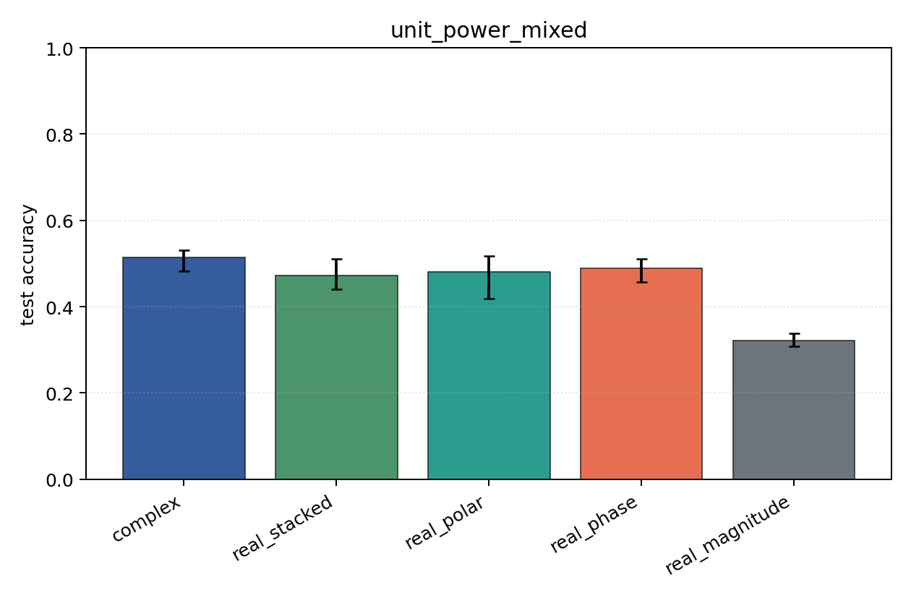
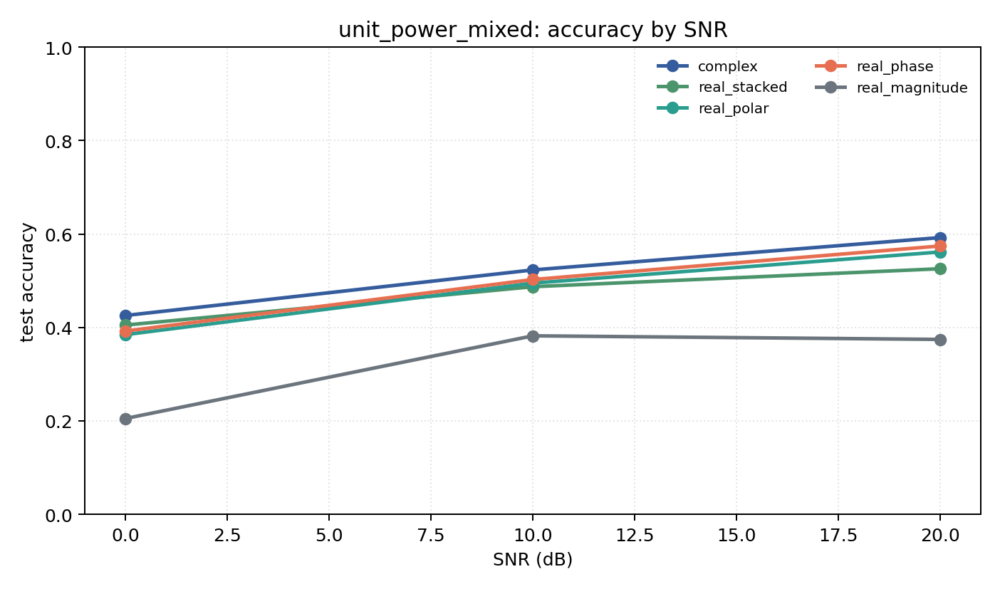

# unit_power_mixed

Question: Does per-example energy normalization change the ranking?

Contradiction signal: rankings change substantially, suggesting models were using energy/SNR scale rather than modulation geometry.

Modulations: `['bpsk', 'qpsk', '8psk', 'qam16', 'qam64']`. SNR (dB): `[0, 10, 20]`. Architecture: `conv`. Activation: `zrelu`. Train transform: `unit_power`. Test transform: `unit_power`.

## Plots

| model | hidden | params | MAdds | accuracy | std | 95% CI | loss | s/run |
| --- | ---: | ---: | ---: | ---: | ---: | --- | ---: | ---: |
| `complex` | 16 | 2954 | 348480 | 0.5137 | 0.0274 | [0.4821, 0.5308] | 1.04 | 0.79 |
| `real_stacked` | 16 | 1557 | 92240 | 0.4726 | 0.0350 | [0.4410, 0.5103] | 1.08 | 0.31 |
| `real_polar` | 16 | 1637 | 97360 | 0.4803 | 0.0544 | [0.4179, 0.5179] | 1.1 | 0.31 |
| `real_phase` | 16 | 1557 | 92240 | 0.4897 | 0.0291 | [0.4564, 0.5103] | 1.11 | 0.31 |
| `real_magnitude` | 16 | 1477 | 87120 | 0.3205 | 0.0160 | [0.3077, 0.3385] | 1.44 | 0.31 |

## Accuracy by SNR (dB)

| model | 0 dB | 10 dB | 20 dB |
| --- | ---: | ---: | ---: |
| `complex` | 0.426 | 0.523 | 0.592 |
| `real_stacked` | 0.405 | 0.487 | 0.526 |
| `real_polar` | 0.385 | 0.495 | 0.562 |
| `real_phase` | 0.392 | 0.503 | 0.574 |
| `real_magnitude` | 0.205 | 0.382 | 0.374 |
